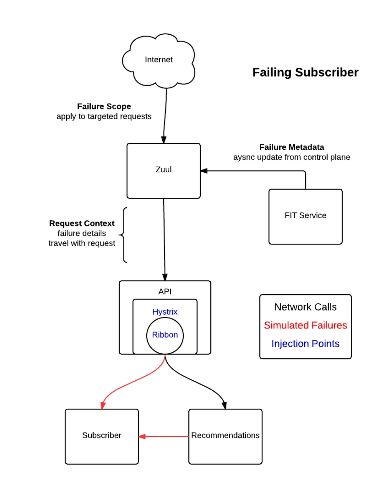
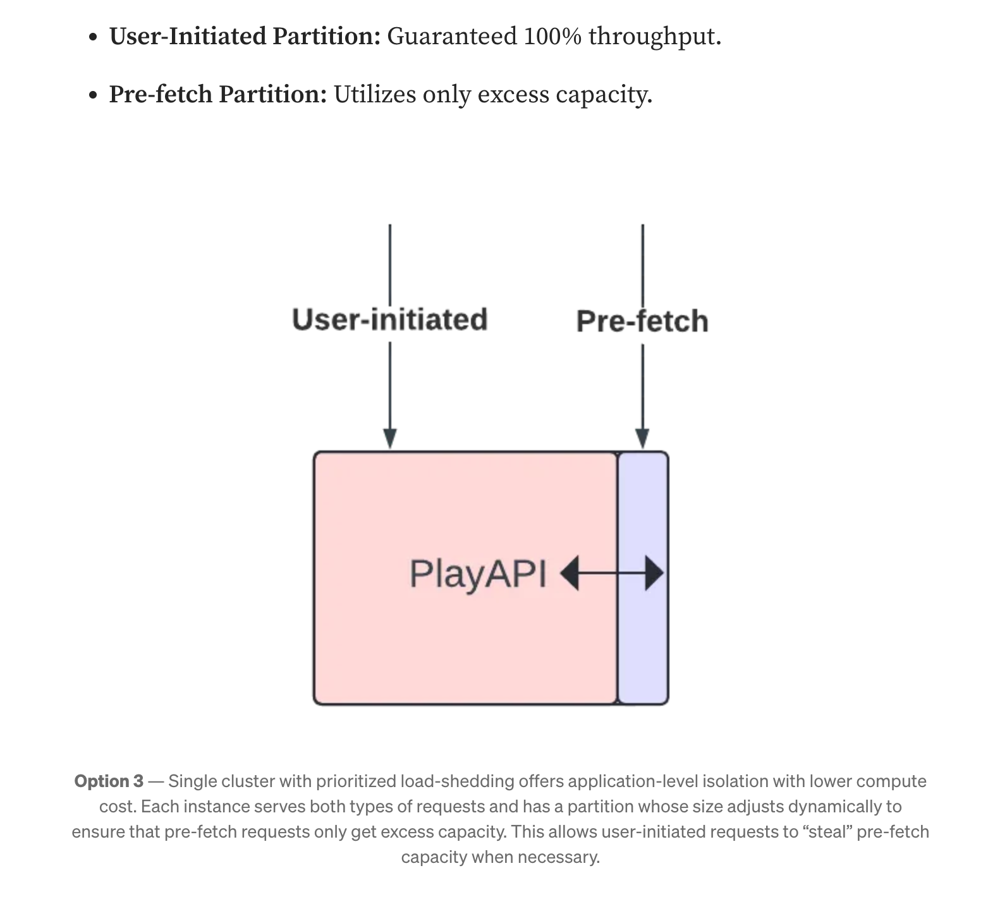
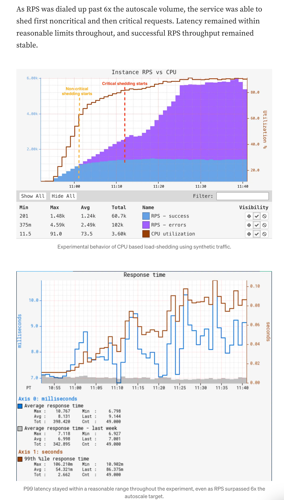

## Netflix's prioritized load shedding

### what is load shedding?
- shed: 버리다
    - load shedding: request 버리기
- vs. throttling vs. circuit breaker
    - throttling(rate limiting) : control the rate of traffic
    - circuit breaker: pattern to detect failure and prevent the propagation of the error/load
    - load shedding: control the load of load
    - circuit breaker, load shedding 모두 전력에서 사용하는 단어

### api gateway

- 호출 구조
    ```
    client -> api-gateway -> server
    ```
- request를 3가지 priority level로 구분
    - 기준: throughput, functionality, criticality
    - NON_CRITICAL
        - 사용자 경험에 영향 X
        - ex) logs, background requests
        - usually high throughput -> high load

    - DEGRADED_EXPERIENCE
        - 사용자 경험에 영향을 주지만, 영상 재생(core 기능)에 영향 X
        - ex) stop, pause 버튼, language selection, view history, ..

    - CRITICAL
        - 영상 재생(core 기능)에 영향을 줌
        - 실패시 사용자에게 에러가 표시됨

- api-gateway에서 요청 별로 priority score를 계산해서 3가지 중 하나의 bucket에 배정
- api-gateway에서 요청을 drop(throttling)
    - service throttling
        - api-gateway에서 backend service를 모니터링해서, threshold를 넘으면 throttling
        - key metric: error rate와 concurrent request
    - global throttling
        - api-gateway 가 unhealthy이면 동작
        - key metric: CPU utilization, concurrent requests, and connection count

- 요청을 drop하면, client에게는 retry 정보를 반환한다.
    ```json
    { “maxRetries” : <max-retries>, “retryAfterSeconds”: <seconds> }
    ```
    - higher priority이면 더 적극적으로 retry를 실행하도록 한다

- validating the impact
    - simulation
        - chaos monkey: 다수의 실사용자에게 영향을 준다 -> 위험하다
        - [FIT(Failure Injection Testing)](https://netflixtechblog.com/fit-failure-injection-testing-35d8e2a9bb2)
        - api-gateway에 failure scenario를 주입 \
            -> backed-server에서 scenario를 실행 & 검증
        

    - A/B testing
        - 일부 실 사용자에게 45분 동안 노출(실험군, 대조군)

### service-level
- load shedding을 api-gateway가 아니라 service에서 처리
    - service team이 prioritization logic을 관리 -> 자유도 증가
    - api-gateway를 통하지 않는 API도 제어 가능
    - service 입장에서는 여러 개의 cluster를 이용하는 대신, 1개의 cluster를 더 효율적으로 사용할 수 있다.

- request를 2가지 priority level로 구분
    - user-initiated Requests (critical)
        - 사용자가 play button 클릭시 호출됨
        - 영상 시청에 직접적인 영향
    - pre-fetch Requests (non-critical)
        - 사용자가 영상 시작 버튼을 누르기 전에, latency 향상을 위해 prefetch하는 API
        - 호출이 실패해도 이상 없음. play button 누를 때 latency가 조금 늘어나는 정도

- problem before
    - pre-fetch request의 spike가 user-initiated request에 영향을 준다
    - backend service의 latency 증가가 user-initiated request, pre-fetch request에 동일한 영향을 준다
- solution
    - user-initiated request에 더 높은 priority를 준다
    - partitioning 해서 user-initiated는 100% throughput을, pre-fetch는 가용량에 따라 처리한다

    

- anti-pattern
    - no shedding
    - too aggressive

- 결과(cpu based)
    


### generic service work prioritization
- priority level
    - CRITICAL
        - Affect core functionality — These will never be shed if we are not in complete failure.
    - DEGRADED
        - Affect user experience — These will be progressively shed as the load increases.
    - BEST_EFFORT
        - Do not affect the user — These will be responded to in a best effort fashion and may be shed progressively in normal operation.
    - BULK
        - Background work, expect these to be routinely shed.

- cpu based
    - priority 별로 threshold를 정해서, cpu 사용량이 threshold를 넘으면 drop
    - scale out은 cpu 기준일 때가 많은데, scale out시 시간을 벌 수 있다

- io based
    - IO-bound by backing services or datastores
    - 기준
        - endpoint별로 maximum latency
        - netflix storage service가 반환하는 slo 지표


### 출처
- api-gateway level: https://netflixtechblog.com/keeping-netflix-reliable-using-prioritized-load-shedding-6cc827b02f94
- service level: https://netflixtechblog.com/enhancing-netflix-reliability-with-service-level-prioritized-load-shedding-e735e6ce8f7d
