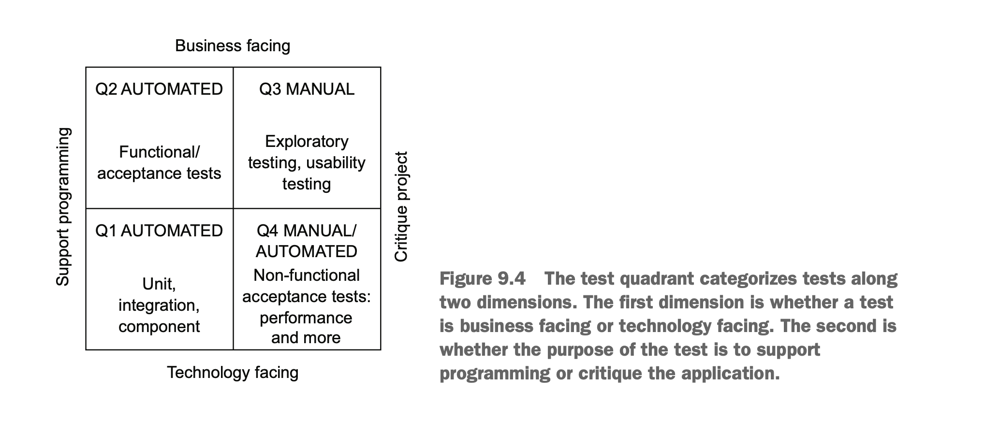
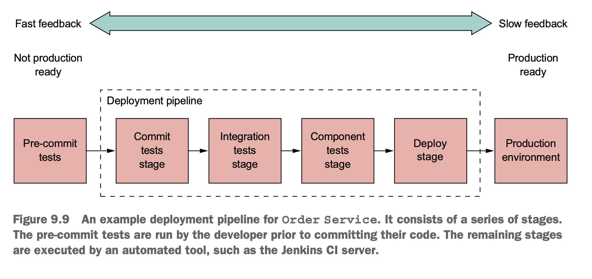

# 9. Testing microservices: part 1
## introduction to testing
- overview of testing
    >  A test case is a set of test inputs, execution conditions, and expected results developed for a particular objective, such as to exercise a particular program path or to verify compliance with a specific requirement.
    
    - purpose of test: verify the behavior of the System Under Test(SUT)
    - system: software element being tested. class/application/...
    - a collection of related tests form a test suite

- test steps
    - 1\.setup: initialize test fixture(sut and its dependencies)
    - 2\. exercise: invoke
    - 3\. verify
    - 4\. teardown: clean up test fixture

- mocks and stubs
    - test double: object that simulates the behavior of the dependency
    - stub: a test double that returns values to the SUT
    - mock: a test double that a test uses to verify that the SUT correctly invokes a dependency
- types of test
    - unit test: test small part like class
    - integration test: verify that a service can interact with infrastructure service such as DB, other application services
    - component test: acceptance test for an individual service
    - end-to-end-test: acceptance tests for the entire application
- test quadrants to categorize tests
    - dimensions
        - whether the test is business facing or technology facing
        - business facing test: described by domain experts' terms
        - technology facing test: described by developers' terms
        - the goal of test is to support programming or critique the application
    - quadrants
        

        - Q1: Support programming/technology facing: unit and integration tests
        - Q2: Support programming/business facing: component and end-to-end test
        - Q3: Critique application/business facing: usability and exploratory testing
        - Q4: Critique application/technology facing: nonfunctional acceptance tests such as performance tests

- test pyramid
    - should write fewer tests as we move up the pyramid

## testing patterns
- challenge of testing microservices
    - Interprocess communication plays a big role in microservices. \
    each communication is a contract
- consumer-driven contract testing
    - verify that the provider’s API meets the consumer’s expectations
    - verify that provider
        - has expected http method and path
        - accepts the expected headers
        - accepts a request body
        - returns a response with expected status code, headers, and body
    - do not test the provider's business logic
    - consumer writes a contract test suite and adds it to the provider's test suite
- consumer-driven contract test
    - verify that service meets the expectation of its clients
    - testing by examples(=contract consists of examples)
- consumer-side contract test
    - verify that the client can communicate with the service

### testing with spring cloud contract
- popular contract testing frameworks
    - spring cloud contract
    - pact family of frameworks
- steps
    - 1\. write contract(request and expected response)
    - 2\. provider team tests service by the test generated by Spring Cloud Contract
    - 3\. service team publishes the contract to maven repository
    - 4\. client write test based on published contracts

### deployment pipeline
- developer's desktop to production

- Pre-commit tests stage: unit tests. by the developer before committing
- Commit tests stage: Compiles the service, runs the unit tests, and performs static code analysis.
- Integration tests stage
- Component tests stage
- Deploy stage: Deploys the service into production.

## unit test
- unit test: lowest level of the test pyramid. \
unit: typically a class
- types
    - solitary unit test
        - test a class in isolation using mock
        - controller, service classes
        - inbound, outbound adapters
    - sociable unit test
        - test a class and its dependencies
        - domain objects, saga
