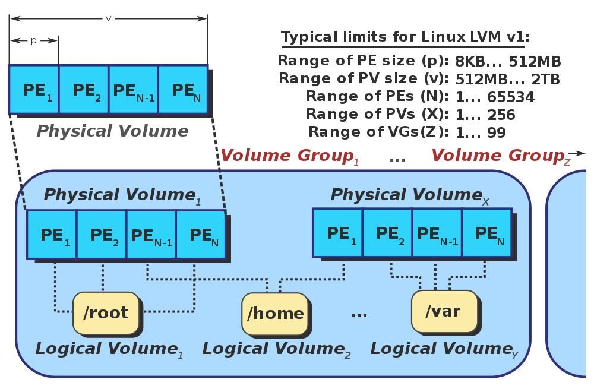

## Chapter5. FileSystems

- most resources in Linux are files

### Basics

- assumptions & expectations
  - most filesystems are hierarchical. starting with root(/)
  - two different types of object: directory, file
  - permissions are built in
  - generally, filesystems are implemented in the kernel \
    optionally implemented in user land(FUSE:Filesystem in Userspace)
- terms

  - drive
    - a (physical) block device. ex) HDD(hard disk drive), SSD(solid disk drive)
    - a drive can be emulated in the context of virtual machine. ex) /dev/sda(SCSI device), /dev/sdb(SATA device), /dev/hda(IDE device)
      - SCSI, SATA, IDE device: hard drive interface types. interface between hard drive and computer
      - https://www.freecodecamp.org/news/types-of-hard-drives-sata-pata-scsi-and-more-2/
      - https://www.linkedin.com/advice/3/what-pros-cons-sata-ide-scsi-hard-drive
      - ATA(AT Bus Attachment. Advanced Technology Attachment)
      - PATA(Parallel Advanced Technology Attachment. Parallel ATA)
        - =IDE(Integrated Drive Electronics). first ATA
        - standard interface that defines the connection between a bus on a computer motherboard and disk storage device
        - Originally drive controllers and disks were implemented as separate devices, often built by different manufacturers and were located separately, usually . IDE refers to the drive controller is integrated in the drive.
        - use parallel signalling(=transfer multiple bits of data simultaneously)
      - SATA(Serial Advanced Technology Attachment)
        - superseded PATA
        - transfer one bit at a time
        - faster transmission date(150-300 MB/S)
        - thinner cable ad limit of
      - SCSI(Small Computer System Interface)
        - drive itself has a processor. -> performance of drive is not dependent on the computer's spec
        - widely used in servers
        - better than SATA.
      - NVMe(Non-volatile Memory Express)
        - interface for non-volatile storage media usually attached via the PCI Express bus
        - designed to capitalize low latency and internal parallelism of SSD
    - partition
      - Drive can be logically split up into partitions.
      - ex) /dev/sdb1, /dev/sdb2
    - volume
      - similar to partition, but more flexible
      - a storage area that can be accessed using a single file system. can have multiple partitions
      - formatted for specific filesystem
    - super block
      - special section in the filesystem that contains metadata of the filesystem
      - includes filesystem type, blocks, state, how many inodes per block
    - inodes
      - store metadata about file, such as size, owner, location, data, and permission
      - does not contain filename and actual data.

- Partition vs Volume
  - Partition: just a split of drive(physical device)
  - Volume: once a “partition” has been formatted, assigned a file system and drive letter it becomes a “volume” capable of storing data with which the user can interact
  - ref: https://davescomputertips.com/differences-between-disk-drive-partition-volume/
- commands

  | command             | use case                                  |
  | ------------------- | ----------------------------------------- |
  | lsblk               | list all block device                     |
  | fdisk, parted       | manage disk partition                     |
  | blkid               | show block device attributes such as uuid |
  | hwinfo              | show hardware info                        |
  | file -s             | show filesystem and partition information |
  | stsat, df -i, ls -i | show and lst inode-related information    |

- links
  - hard link
    - directory reference(entry) to inodes. creating another path to the file. effect of aliasing
    - can't create hard link to directory. due to risk of circular reference
    - can not create across filesystem. File is identified by the inode number which is unique in the filesystem. Thus file can not be indexed with same inode in different file system
  - symbolic link, symlink: special file with their content being a string representing the path of another file

### The Virtual File System

- Linux provides file-like access to many sorts of resources through an abstraction called virtual file system(vfs)
- VFS is an abstraction layer in the kernel that provides clients a common way to access resources, based on the file diagram.
- file does not have predescribed structure. jst a stream of bytes. interpreting it is up to the client
- VFS abstracts access to different kinds of filesystems
  - Local file system
    - ext3, xfs, fat, nfts
    - use drivers to access local block devices such as HDD, SSD
  - in memory filesystem
    - tmpfs that are not backed by RAM
  - pseudo filesystem
    - procf
    - inmemory in nature. used for kernel interfacing and device abstractions
  - network filesystem
    - nfs, samba, netware
    - use driver. the storage devices are at remote. -> driver inolves network operation
- operations of VFS

  | category    | examples                                     |
  | ----------- | -------------------------------------------- |
  | inodes      | chomod, chown, stat                          |
  | files       | open, close, seek, truncate, read, write     |
  | directories | chdir, getcwd, link, unlink, rename, symlink |
  | filesystems | mount, flush, chroot                         |
  | others      | mmap, poll, sync, flock                      |

### Logical Volume Manager

- layer to decouple physical entities(ex. drive, partitions) with the file system
  - risk-free, zero-downtime expanding and automatic storage extension through pooling of resource

#### Device Files

- device file, or special file

  - a file that allows an application to access hardware devices via standard i/o system calls.
  - these files are grouped into the `/dev` directory.
  - system call open, read, write, close, lseek, mmap, etc are redirected by the operating system to the device driver associated with the physical device.
  - device driver is a kernel component

- 2 kinds of device files and device driver

  - speed, volume, how the data is transferred between the device and the system
  - character device

    - ex) keyboard, mouse, serial ports, sound card, joystick
    - slow devices. manage small data. access data that does not require frequent seek query
    - read/write are performed sequentially byte by byte
    - device driver
      - system call go directly to device driver

  - block device

    - ex) hard drives, CD-ROM, RAM disk
    - nonvolatile mass storage devices that support random access and organizes data in fixed-size blocks
    - volume is large. data is stored on blocks. search is common
    - read/write is done at the data block level
    - device driver
      - there is a mediator between the user-space and the block device driver: file management subsystem, block device system
      - roles: prepare the device driver's necessary resources(buffers), to keep the recently read data in the cache buffer, and to order the operations for performance reasons

  - buffer: temp space used while data is moved from one place to another

- ref
  - https://linux-kernel-labs.github.io/refs/heads/master/labs/device_drivers.html

#### Logical Volume, Physical Volume

- Extent

  - the smallest unit of space that can be allocated
  - physical volume is allocated with physical extents, logical volume with logical extent
  - physical extent is mapped one-to-one to logical extent

- Physical Volume

  - can be a disk partition, entire disk drive, and other device
  - composed of a sequence of chunks called physical extents(PEs).
  - PE can be uniform size, but not always

- Volume Group

  - a disk space pool of PV

- Logical Volume

  - the pooled LEs can be concatenated together into virtual disk partition => Logical Volume
  - it can be used as a raw block device just like disk partitions

- Why Logical Volume?

  - Traditionally
    - physical devices were split into partition and mounted as directory.
    - to expand the partition, did followings
      - add physical disk & make partition & format
      - mount new directory
      - move original data to new mounted directory
      - remove original directory
      - mount new directory as original directory
  - With Logical Volume,
    - add physical disk & make partition & format
    - create physical volume, and add to volume group
    - increase the size of target logical volume
  - thus, managing volume is now flexible!

- ref
  - https://en.wikipedia.org/wiki/Logical_volume_management
  - https://tech.cloud.nongshim.co.kr/2018/11/23/lvmlogical-volume-manager-1-%EA%B0%9C%EB%85%90/

### Filesystem Operation

- Creating filesystem

  - aka. formatting
  - `mkfs -t <fs type> <device>`
  - take partition or volume as the input

- Mounting filesystem
  - inserting the formatted partition/volume into the filesystem tree
  - `mount -t <fs type> <device> <directory>`
  - must use the same filesystem with the one it has been created with
  - mounts are only valid as long as the system is running. to make it permanent, you should edit `/etc/fstab`. \
    `/etc/fstab` : file system table. it lists all available disk partition, file systems and data sources and indicates how they are initialized and integrated into the larger file system structure

## Common Filesystem Layouts

- filesystem layout: the organization of directories and their content
- formally, called FHS(Filesystem Hierarchy Standard)
- Linux Foundation maintains FHS, but a bit different depending on the distribution

| directory  | semantics                                                             |
| ---------- | --------------------------------------------------------------------- |
| bin, sbin  | system programs and commands(usually links to /usr/bin and /usr/sbin) |
| boot       | kernel images and related components                                  |
| dev        | devices(terminals, drives, etc.)                                      |
| etc        | system configuration files                                            |
| home       | user home directories                                                 |
| lib        | shared system libraries                                               |
| mnt, media | mount points for removable media(ex. USB sticks)                      |
| opt        | distro specific; can host package manager files                       |
| proc, sys  | kernel interfaces                                                     |
| tmp        | for temporary files                                                   |
| usr        | user programs(usually read only)                                      |
| var        | user programs(logs, backups, network cache, etc.)                     |

## Pseudo Filesystem

- pretend to be filesystem but really are wrapping some kernel interface
- it enables us to interact with pseudo filesystem as regular files and directories(ls, cd, cat)

### procfs

- `/proc`
  - publish process-related information from the kernel
  - `/proc/PID`: per-process information
  - mount, networking-related information, TTY drivers, memory information, system version, and uptime

### sysfs

- `/sys`
  - expose specific information
  - `block/`: directory symbolic links to discovered block devices
  - `bus/`: one subdirectory for each physical bus type
  - `class/`: contains device classes
  - `dev/`: two subdirectories: `block/` for block device, `char/` for character devices
  - `devices/`: representation of the block device
  - `firmware/`: firmware specific attributes
  - `fs/`: subdirectories for some filesystems
  - `module/`: subdirectories for each module loaded in the kernel

### devfs

- `/dev`
  - device special files.
  - from physical devices to a random number generator or a write-only data sink
- block devices: handle data in blocks
- character devices: handle things character by character, such as a terminal, a keyboard, or a mouse
- special devices: generate data or help manipulating it. ex) /dev/null, /dev/random, /dev/tty(terminal)

## Regular Files

### Common Filesystem

- ext4
  - widely used file system. used by default in many distributions
  - backward-compatible of ext3
  - offers journaling(changes are recorded in a log), recovery is fast
  - general-purpose
- xfs
  - journaling filesystem
  - offers support for large files, high-speed i/o
  - used for red hast distributions family
- zfs
  - filesystem, volume manager functionality
- fat
  - family of FAT family for linux, vfat is most widely used.
  - main use case: interoperability with windows system, removable media that uses FAT

## In-memory Filesystems

- debugfs
  - special purpose filesystem for debugging
  - usually mounted with `mount -t debufs none /sys/kernel/debug`
- loopfs
  - mapping a filesystem to a block rather than device
  - often used for CD ISO image and floppy disk image. (disk image: snapshot of a storage device's structure and data)
- pipefs
  - pseudo filesystem mounted on pipe
- sockfs
  - pseudo filesystem that makes network sockets look files, sitting between the syscalls and the sockets
- swapfs
  - for managing swap space
    - swap space: space on a hard disk where inactive pages in memory are moved to
- tmpfs
  - general purpose filesystem that keeps file data in kernel cache
  - fast but nonpersistent

## Copy-on-Write Filesystems

- CoW
  - use less space and increase I/O
- how it works
  - scenario
    - original file(file1): blocks A,B,C
    - copy to file2
  - 1\. rather than copying actual blocks, only the metadata is copied. fast and less space
  - 2\. when file 2 is modified, only changed block(ex. block C) is copied and new block called C' is created
- union mount
  - mount(combine) multiple directories into one location
  - that directory contains the union of the contents
- filesystems
  - unionfs
    - implements a union mount for cow filesystem
    - widely popular and used in the context of CD-ROMs and DVDs
  - overlayFS
    - once a file is opened, all operation are directly handled by the underlying filesystem
    - nowadays docker's default
  - AUFS
    - used to be docker's default
  - btrfs
    - short for b-tree filesystem
    - features: snapshots, automatic detection of silent ata corrupts.
    - suitable for professional environments. ex) server
