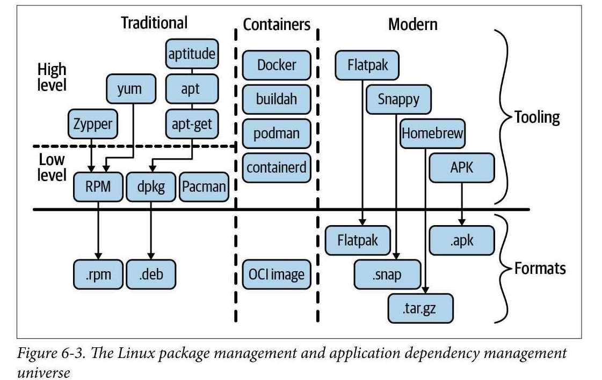

## Chapter 6. Applications, Package Management, and Containers

- how linux starts up and starts the services: boot process. \
  init system(de-facto: systemd)
- package management system

## Basics

- program
  - binary file or script. executable
- process
  - running entity based on a program
- daemon
  - daemon service. service. background process that provides a certain function to other processes
- application
  - a program including its dependencies.
  - use this word with the life cycle of a program, configuration, data. installing, upgrading, removing
- package
  - a file that contains programs and configurations
  - used to distribute software applications
- package manager
  - install/upgrade/remove packages from linux environment
- booting
  - startup sequence in linux.
  - hardware, os initialization, loading the kernel and learning service(daemon)

## linux startup process

1. UEFI or BIOS(hardware level)
   - in modern environment \
      UEFI(Unified Extensible Firmware Interface) spec defines the boot configuration and boot loader.
   - in older system \
      POST(the Power On Self Test) -> BIOS(Basic I/O System) initializes hardware -> boot loader
2. boot loader(hardware level)
   - bootstrap the kernel. detail depends on the boot medium
3. kernel(kernel space level)
   - usually located in `/boot` directory in a compressed form
   - step1 : extract and load kernel into main memory
   - step2 : initialize subsystem, filesystem, drivers
   - end of boot system
4. init system(user space level)
   - launces daemon, handle orphaned process
   - init process: root of the process hierarchy. PID 1. runs until the power is off
5. user-space-level initializations (user space level)
   - terminal, environment, shell initialization
   - display manager, graphical server, GUI, user preference and configuration of account

from now on, focusing on init system `systemd`

### SysV init

- traditional init system in linux which inherited from Unix.
- it had run levels(halt/single-user/multi-user/GUI mode)
- configuration stroed in `/etc/init.d`
- downside: not-portable. daemon started sequentially, distro-specific handling

## systemd

- initially init system, a replacement of `initd`
- today, includes logging, network configuration, network time synchronization
- flexible, portable way to define daemons and their dependencies
- almost all linux distributions are using systemd
- why good?
  - provides uniform way to manage startup across distros
  - faster, more comprehensible service configurations
  - offers modern management suite including monitoring resource, usage control(via cgroup), built-in auditing

### units

- objects that systemd knows how to handle
  - broader than `service`. includes network, devices, ....
  - configuration for units are stored in unit file
- types of units
  - service
    - describes how to manage a service or application on the server.
    - including how to start/stop the service. autostart, dependency and ordering information for related sw
  - socket
    - describes a network or IPC socket, or a FIFO buffer that systemd uses for socket-based activation.
    - always have an associated `.service` file that will be started when activity is seen on the socket that this unit defines.
  - device
    - describes a device that needs systemd's management
  - mount
    - mount point that should be managed by systemd
    - named after mount path, replacing slash to dashes
    - entries with /etc/fstab can have units created automatically
  - automount
    - configures a mount point that will be automatically mounted.
    - must be named after the mount point
    - must have mount unit
  - swap
    - describes swap space
    - name must reflect the device or file path of the space.
  - target
    - provides synchronization points for other units when booting up or changing states.
    - also used to set system to new state
  - path
    - defines a path for path-based activation
    - by default, when the patch reaches the specified state, service unit with same base name will be started
  - timer
    - defines a timer that will be managed by systemd. like cron.
    - matching unit will be started when the timer is reached
  - snapshot
    - created automatically by the systemctl snapshot command.
    - used for rollback of temporary states. do not survive across sessions
  - slice
    - associated with linux control group nodes
    - restriction on resource access/assignment to process
  - scope
    - automatically created from bus interfaces
    - manage sets of system process that are created externally
- location of unit files
  - `/lib/systemd/system`
    - package installed units. default location
    - do not change files here but override by creating unit files in following locations
  - `/etc/systemd/system`
    - system admin configured units
    - higher priority than `/lib/systemd/system`
    - put overriding unit configurations here.
    - to override specific part, put it in a subdirectory. ex) `example.service.d/my.conf`
  - `/run/systemd/system`
    - nonpersistent runtime
    - priority: `/lib/systemd/system` < `/run/systemd/system` < `/etc/systemd/system`
- how does a unit file looks like

  - format
    ```conf
    [Section]
    Directive1=value
    Directive2=value
    ```
  - example: nginx

    - https://www.nginx.com/resources/wiki/start/topics/examples/systemd/
    - `/lib/systemd/system/nginx.service`

    ```conf
    [Unit]
    Description=The NGINX HTTP and reverse proxy server
    After=syslog.target network-online.target remote-fs.target nss-lookup.target # these will be started before nginx. but not dependency. dependency use directive requires
    Wants=network-online.target # loose dependency. will try to start these units when activating nginx, and will continue even if units in wants are not found or fail to start

    [Service]
    Type=forking
    PIDFile=/run/nginx.pid
    ExecStartPre=/usr/sbin/nginx -t # additional commands before starting main process
    ExecStart=/usr/sbin/nginx  # full path to start the process
    ExecReload=/usr/sbin/nginx -s reload
    ExecStop=/bin/kill -s QUIT $MAINPID
    PrivateTmp=true

    [Install]
    WantedBy=multi-user.target
    ```

- tools for `systemd`

  - systemctl
    - systemctl {enable/start/stop/restart/reload/kill/status} xxx.service
    - systemctl daemon-reload: reload all unit files
  - bootctl
    - check boot loader status, manage available boot loaders
  - timedatectl
    - set and view time and date related information
  - coredumpctl
    - process saved core dumps. for trouble shooting
  - journalctl
    - journal is a component of `systemd`
    - binary file managed by `systemd-journald` daemon
    - centralized logging of systemd

- step by step process
  - create unit file `nginx.service`
  - copy it to `/lib/systemd/system`
  - start service
    - in debian, system is automatically started.
    - in redhat, should explicitly `systemctl start nginx.service`
  - check status: `systemctl status nginx.service`
  - journal: `journalctl -f -u nginx.service`

## Linux Application Supply Chains

- a system of organizations and individuals supplying a product to a consumer
- components
  - software maintainers
  - repository: list of packages with metadata, dependencies
  - tooling: a package manage
    - lookup packages in the repository, install, update, remove



> (from the book)

- traditional package managements
  - 2 categories: low-level/high-level
  - high-level: package manager can resolve dependencies and provides a high level interface(install, update, remove)
- container-based solutions
  - initially came out of the server and cloud computing
  - primary usage: application management
- modern package manager
  -roots in desktop environment

  - main goal is to make end user easily consume app

  ## package and package managers

  - stem from two major linux distribution families: Red Hat(RHEL, Fedora, CentOS, etc) and Debian-based(Debian, Ubuntu, etc)
  - 2 concepts
    - package: a file that usually is zipped and may contain metadata
    - tooling(package manager): interacts with repo. maintain local cache of packages

### RPM Package Manager

- created by Red Hat but widely used
- `.rpm` file: used in Linux Standard Base and contain binary or source file.
- package can be cryptographically verified and support delta updates via patch files
- package manager that use RPM
  - yum: Amazon Linux, CentOS, Fedora, RHEL
  - DNF: CentOS, Fedora, and RHEL
  - Zypper: openSUSE, SUSE Linux Enterprise

### Debian deb

- `deb`, `.deb` file: originate from Debian distro
- package manager that use deb
  - low-level: dpkg
  - high-level: apt-get, apt, aptitude

### Language Specific Package Manager

- C/C++: Conan, vcpkg
- Go: built in
- Node.js: npm
- Java: maven, nuts
- Python: pip, PyPM
- Ruby: rubygems, Rails
- Rust: cargo

## Containers

- container: a linux process group that uses linux namespaces, cgroups, and optionally CoW filesystem to provide application-level dependency management
- OCI(Open Container Initiative)
  - project under Linux Foundation.
  - establish common standards for container format and runtimes
  - 3 specifications
    - runtime specification
      - what a runtime needs to support. including operations and lifecycle phase
    - image format specification
      - how container images are constructed based on metadata and a layer
    - distribution specification
      - how container images are shipped, effectively the way repositories work in the context of containers

## Linux Namespaces

- used to restrict resource visibility of operating system resources of processes. not a hard boundary from a security perspective. (Linux initially had a global view on resource)
- relevant syscalls to create ns
  - clone: create a child process that can share its execution context with the parent process
  - unshare: remove a shared execution context from an existing process
  - setns: join an existing process to an existing namespace
- syscalls
  - CLONE_NEWNS: use for filesystem mount points
  - CLONE_NEWUTS: create hostname and NIS domain name isolation
  - CLONE_NEWIPC: do interprocess communication(IPC) resource isolation
  - CLONE_NEWNET: control visibilty of network system resource ex network devices, IP addresses, IP routing table and port numbers
  - CLONE_NEWUSER: map UID+GID inside/outside the namespace
  - CLONE_NEWCGROUP: manage cgroups
- view namespaces
  ```bash
  $ lsns
  NS TYPE  NPROCS    PID USER     COMMAND
  4026531836 pid        2 107414 irteamsu -bash
  4026531837 user       2 107414 irteamsu -bash
  4026531838 uts        2 107414 irteamsu -bash
  4026531839 ipc        2 107414 irteamsu -bash
  4026531840 mnt        2 107414 irteamsu -bash
  4026532244 net        2 107414 irteamsu -bash
  ```

## Linux cgroups

- mechanism to organize process group and control resource usage
- cgroup is a `unit`, controller is a piece of kernel code that limits resources or reports on its usage
- versions: v1, v2
  - v1 still widely used
  - but v2 will eventually replace v1
  - v1
    - ad hoc approach. adding new cgroups and controllers as needed
  - v2
    - total rewrite of v1 with lessons learned from v1.
    - Unlike per-process cgroup v1 design, cgroup v2 has only single hierarchy, and all controllers are managed the same way
    - kinds: CPU controller, Memory controller, I/O controller, PID controller, cpuset controller, device controller, rdma(remote direct memory access) controller, Huge TLB controller
- tree view of cgroups
  ```bash
  $ systemctl status
  ● my-vm
      State: degraded
      Jobs: 0 queued
  Failed: 2 units
      Since: Wed 2023-04-26 16:46:45 KST; 10 months 14 days ago
  CGroup: /
          ├─1 /usr/lib/systemd/systemd --switched-root --system --deserialize 2
          ├─user.slice
          │ ├─user-11000.slice
          │ │ └─session-550722.scope
          │ │   ├─107413 login -p -h 10.113.130.44 -f irteamsu
          │ │   ├─107414 -bash
          │ │   ├─108359 systemctl status
          │ │   └─108360 less
          │ ├─user-500.slice
          │ │ ├─session-217091.scope
          │ │ │ └─29708 /home1/irteam/.local/share/kubebuilder-envtest/k8s/1.23
          │ │ └─session-202366.scope
          │ │   ├─56161 /home1/irteam/.local/share/kubebuilder-envtest/k8s/1.23
          │ │   └─60350 /home1/irteam/.local/share/kubebuilder-envtest/k8s/1.23
          │ └─user-0.slice
          │   └─session-c1.scope
          │     ├─1345 ./box -c ./HostAgentApp.xml -d -D project=prov-kr
          │     ├─1347 ./box -c ./HostAgentApp.xml -d -D project=prov-kr
  lines 1-24...skipping...
  ● my-vm
      State: degraded
      Jobs: 0 queued
  Failed: 2 units
      Since: Wed 2023-04-26 16:46:45 KST; 10 months 14 days ago
  CGroup: /
          ├─1 /usr/lib/systemd/systemd --switched-root --system --deserialize 21
          ├─user.slice
          │ ├─user-11000.slice
  ```
- `systemd-cgtop`: interactive resource usage view

## Copy-on-Write Filesystem

### Docker

- what is so special?
  - cgroup, namespace existed prior to docker
  - docker hides the complex concepts like cgroup, namespace
- container image
  - compressed archive file that contains metadata in json file and the layers, which are effectively directories

### alternatives

- containerd
  - daemon that manages the OCI container lifecycle, from image transfer and storage to container runtime supervision
- skopeo
  - container image manipulation(copying, inspecting)
- systemcd-cgtop
  - interactive resource usage view
- nsenter
  - execute a program in a specified, existing namespace
- unshare
  - run a program with specific namespace
- lsns
  - list information about linux namespaces
- cinf
  - list information about linux namespace and cgroups

## Modern package managers

- Snap
- Flatpak
- [AppImage](https://appimage.org/)
  - one app equals one file \
    that is, no dependencies to run an app except what is included in the targeted linux system
- Homebrew
