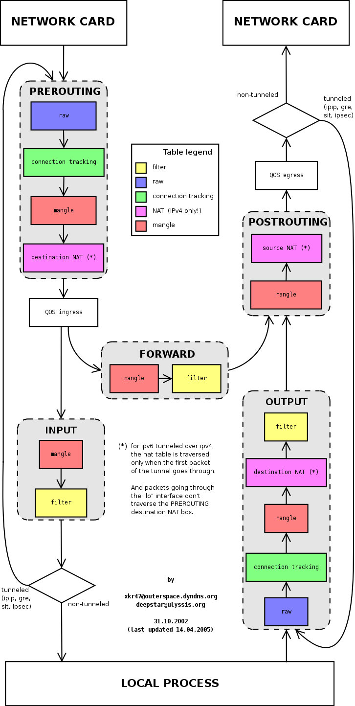

## Chapter7. Networking

- almost every protocol and interface is based on publicly available specifications
- IETF(Internet Engineering Task Force) makes all of those requests of comments(RFCs) freely available via [datatracker.ietf.org](https://datatracker.ietf.org/)

## TCP/IP Stack

- each layer must be able to communicate with only the layers right above and below itself
- data is encapsulated in packets, and each layer typically wraps the data in a header
- `header + payload` of a higher layer makes up the payload for the next layer

### overview

- link layer
  - the lowest layer. covers the hardware(Ethernet, Wifi) and kernel drivers.
  - focus how packets are sent between physical device
- internet layer
  - with IP(Internet Protocol), do routing. that is, sending packets between machines
- transport layer
  - communication between hosts
  - kinds
    - TCP(Transmission Control Protocol) for session-based, reliable communication
    - UDP(User Datagram Protocol) for connection-less communication
  - how packets are transmitted, including addressing individual services on a machine via port. also socket
- the application layer
  - user facing tooling and apps.
  - web, ssh, mail

### the link layer

- ethernet
  - network that uses wires to connect machines. LAN
- wireless(wifi)
  - communication protocol and method that uses electromagnetic waves
- MAC address
  - MAC: media access control.
  - unique 48-bit identifier for hardware, used to identify machine(precisely, network interface)
- interface
  - a network connection. can be a physical interface or a virtual interface like loopback

#### Network Interface controller(NIC)

- or, Network Interface card
- hardware equipment that transforms digital representation of bytes <-> electrical/electromagnetic signals
- traditional way: ifconfig. modern way: ip link show
- ex) traditional
  ```bash
  % ifconfig
  lo0: flags=8049<UP,LOOPBACK,RUNNING,MULTICAST> mtu 16384
      options=1203<RXCSUM,TXCSUM,TXSTATUS,SW_TIMESTAMP>
      inet 127.0.0.1 netmask 0xff000000
      inet6 ::1 prefixlen 128
      inet6 fe80::1%lo0 prefixlen 64 scopeid 0x1
      nd6 options=201<PERFORMNUD,DAD>
  ```
  - mtu(maximum transmission unit) packet size 65,536 bytes. \
    for historical reasons, ethernet was 1,500 bytes but can use jumbo frames(9,000 bytes in size)
- ex 2)

  ```
  en0: flags=8863<UP,BROADCAST,SMART,RUNNING,SIMPLEX,MULTICAST> mtu 1500
      options=6463<RXCSUM,TXCSUM,TSO4,TSO6,CHANNEL_IO,PARTIAL_CSUM,ZEROINVERT_CSUM>
      ether 74:a6:cd:da:9d:1d
      inet6 fe80::1c7a:656b:abc6:1a4c%en0 prefixlen 64 secured scopeid 0xc
      inet 100.71.56.12 netmask 0xfffff800 broadcast 100.71.63.255
      nd6 options=201<PERFORMNUD,DAD>
      media: autoselect
      status: active
  ```

  - `inet 100.71.56.12`: ip address \
    `ether 74:a6:cd:da:9d:1d`: mac address

#### Address Resolution Protocol(ARP)

- map MAC address to IP address
- command: `arp` or `ip neigh`(modern way)

  ```
  $ arp
  Address                  HWtype  HWaddress           Flags Mask            Iface
  10.106.164.4             ether   70:db:98:96:39:27   C                     eth0
  gateway                  ether   00:00:0c:9f:f0:0a   C                     eth0
  172.17.0.2                       (incomplete)                              docker0
  10.106.164.3             ether   00:a3:8e:5d:90:b7   C                     eth0
  169.254.169.254                  (incomplete)
  ```

### The Internet Layer

- routing packet from one machine to another
- assumptions: network infra is unreliable and the participants change frequently
- best-effort delivery(no guarantees on best performance)
- treats every packet as independent
- thus, higher layer(typically transport layer) handles reliability issue. ex) packet order, retries, delivery guarantees

#### IPv4

- 32 bit number for identifying host or process. segmented into four 8-bits
- ip header defined in RFC 791

  - source address(32bit)
  - destination address(32bit)
  - protocol(8bit)
  - time to live, aka ttl(8bit)
  - type of service(8bit)

- CIDR(Classless Inter-Domain Routing)
  - ex) 10.0.0.0/24
  - first 24 bits represents network
  - last 8 bits are the ip address available for hosts
  - `.0` and `.255` addresses are reserved for special purpose
  - netmask: 255.255.255.0
- reserved ip addresses

  - 127.0.0.0: local address
  - 169.254.0.0/16(169.254.0.0 ~ 169.254.255.255/16)
    - link local addresses. that is, packets sent there should not be forwarded to other parts of the network
    - some cloud providers like AWS us this for special services
  - 224.0.0.0/24(224.0.0.0 to 239.255.255.255)
    - for multicast
  - private ip: not routable on the public internet(by RFC 1918)
    - 10.0.0.0 to 10.255.255.255
    - 172.16.0.0 to 172.31.255.255
    - 192.168.0.0 to 192.168.255.255
  - 0.0.0.0: nonroutable address

    - meaning depends on the context
    - most important meaning. as server, all IPv4 address -> listen on all available IP address

  - IPv4 address is already exhausted. but not moved to IPv6

#### IPv6

- 128-bit number
- hexadecimal, eight group of 16 bits, separating by a colon(:)
- shortening rules
  - removing leading zeros
  - compressing consecutive sections of zeros by `::`
  - ex) loopback address 127.0.0.1 -> ::1
- ipv6 do have reserved address
- ipv4 and ipv6 are not compatible \
  -> to support ipv6, each network participant(ex. mobile device, routers) need to do something.

#### ICMP

- Internet Control Message Protocol
  - RFC 792 defines lower-level component to send error message and operational information
  - `gping`: ping multiple targets && draw graph.
  - `ping6`: for ipv6

### routing

#### netfilter

- framework for network operations provided by kernel
  - packet filtering, network address translation, port translation, ...
  - foundation of firewall
- provides hooks that are triggered on the journey of network stack
  - ex) when packet received, when the packet leaves
- iptables is a utility to manage netfilter hooks
  - add/delete rules for the hook.
- nftables
  - successor of iptables.
  - more flexible, scalable

#### iptables

- basically a set of rules & chains, classified into 5 tables based on the actions

- rules

  - define `action` on a packet \
    ex) reject, drop, log, mangling, ...
  - 2 part: matching, target
    - when `matching` condition is met, `target` is executed
    - target
      - terminating target: return control to the netfilter
      - non-terminating target: continue evaluation within chain

- chains

  - define when the rules will be evaluated
  - each one is associated with netfilter hook
  - `PREROUTING`
    - `NF_IP_PRE_ROUTING` hook
    - triggered when incoming traffic enters the network stack. before routing decision is made
  - `INPUT`
    - `NF_IP_LOCAL_IN` hook
    - triggered when incoming packet is decided to be routed to local system
  - `FORWARD`
    - `NF_IP_FORWARD` hook
    - triggered when incoming packet is decided to be forwarded
  - `OUTPUT`
    - `NF_IP_LOCAL_OUT` hook
    - triggered when outgoing packet hits the network stack
  - `POSTROUTING`
    - `NF_IP_POST_ROUTING` hook
    - triggered after outgoing packet's routing is decided. before being sent out on the wire
  - multiple rules can be registered in a hook. priority is set for evaluation order

- tables
  

  > https://www.linode.com/docs/guides/what-is-iptables/

  - classified by the type of action

  - filter
    - rules for filtering packets by their attributes
    - chains: INPUT, OUTPUT, FORWARD
  - NAT
    - rules for network translation rules \
      whether and how to modify packet's source/destination addresses
    - chains: PREROUTING, OUTPUT, POSTROUTING
  - mangle
    - modify packets(ip headers)
    - ex) change TTL(time to live)
    - chains: INPUT, OUTPUT, FORWARD, PREROUTING, POSTROUTING
  - raw
    - mechanism for marking packets for connection tracking
    - chains: OUTPUT, PREROUTING,
  - security(optional)
    - set internal SELinux security context marks on packets - chains: INPUT, OUTPUT, FORWARD

#### connection tracking

- iptables is stateful. \
  = packets are evaluated in regard to their previous packet \
  = can view packets as part of
  ongoing connection or session instead of a discrete packets
  we can view packets as
- connection tracking provides functionality to perform stateful operations
  - marking connection state \
    when packet is marked with `NOTRACK`, it will be bypassed
  - states
    - NEW: packet that is not associated with an existing connection && not invalid
    - ESTABLISHED: received response from the opposite direction(SYN/ACK for TCP.)
    - RELATED: not part of an existing connection, but associated with one. may be helper connection.
    - INVALID
    - UNTRACKED
    - SNAT: source address has been modified by NAT
    - DNAT: destination address has been modified by NAT



> https://jimmysong.io/en/blog/understanding-iptables/

#### reference

- https://www.baeldung.com/linux/iptables-chains-tables-traversal
- https://www.digitalocean.com/community/tutorials/how-the-iptables-firewall-works
- https://www.digitalocean.com/community/tutorials/a-deep-dive-into-iptables-and-netfilter-architecture
- https://youtu.be/6Ra17Qpj68c?si=M9KZekXPj5lazERW

#### tutorial

```
$ sudo route -n

```
