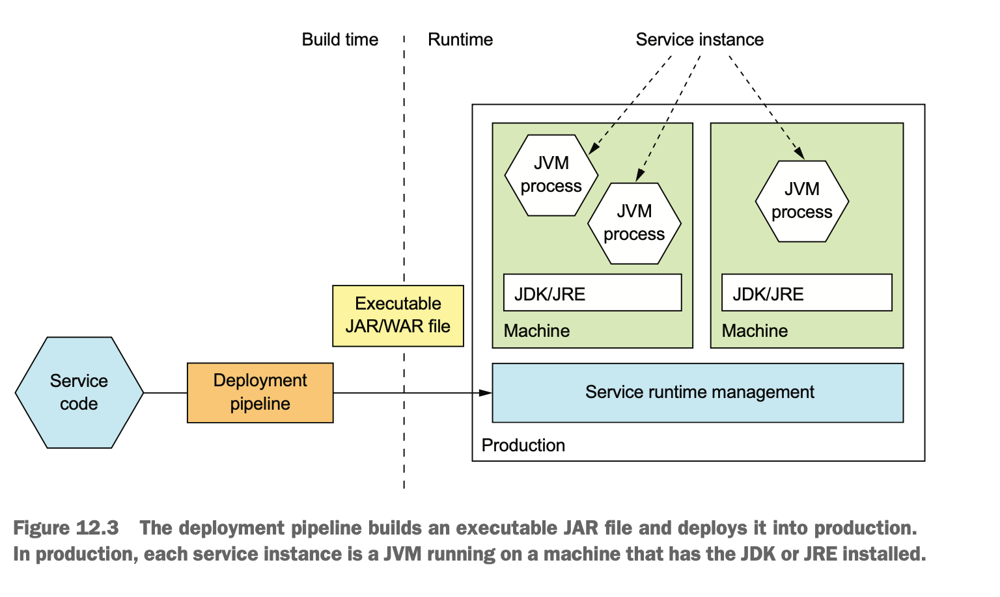
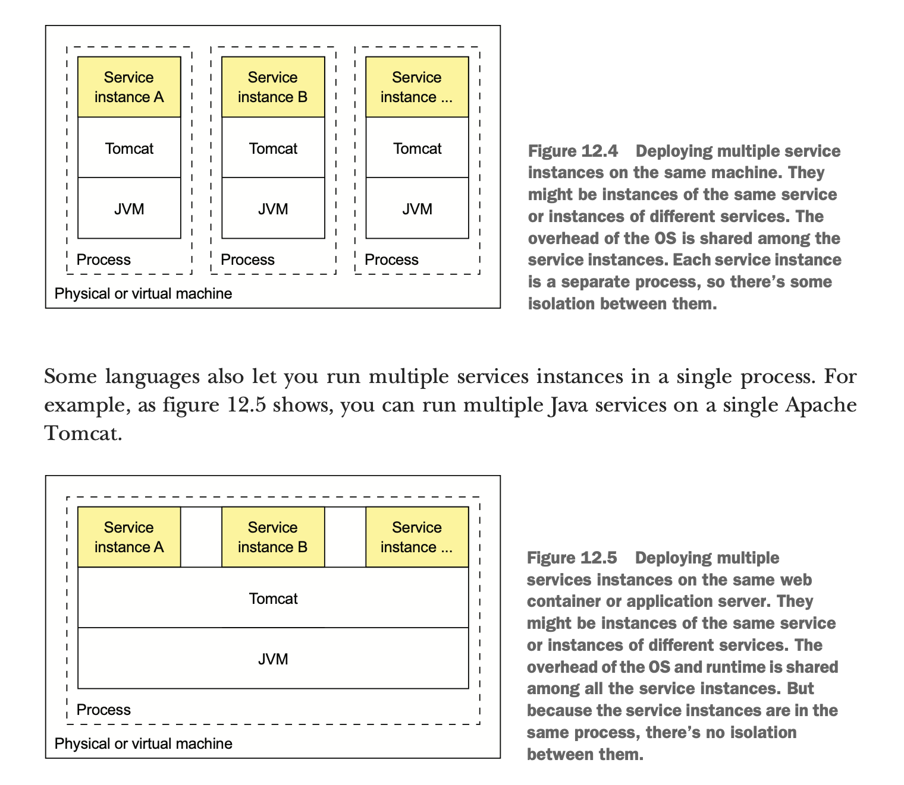
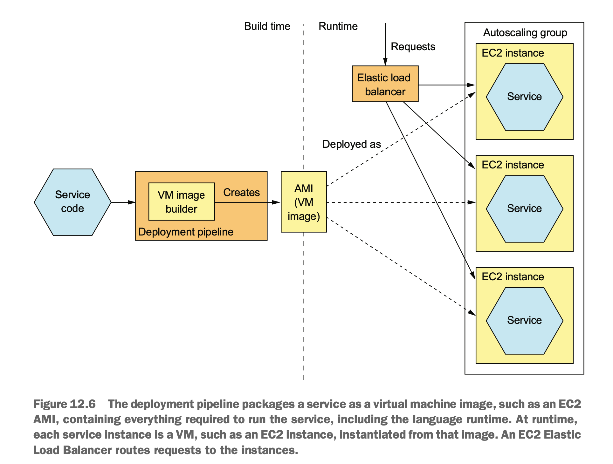
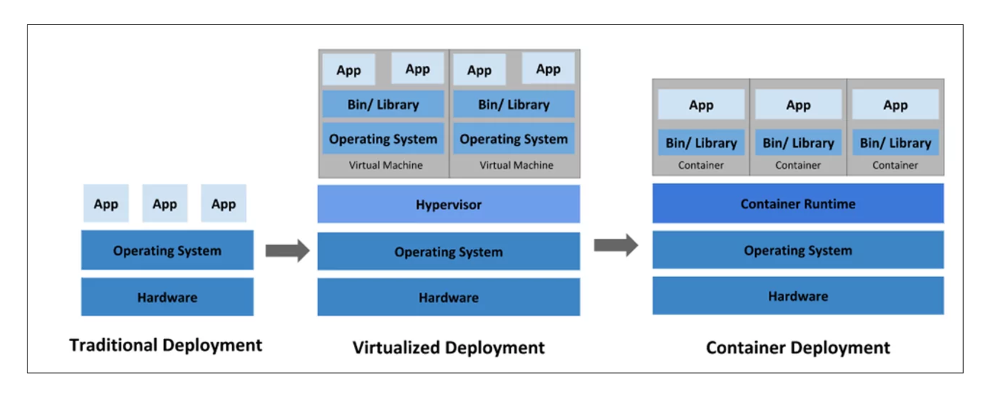
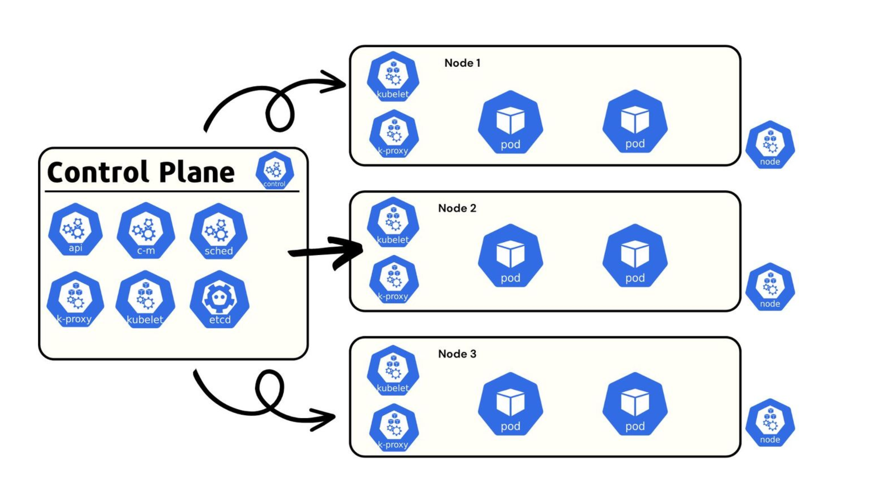
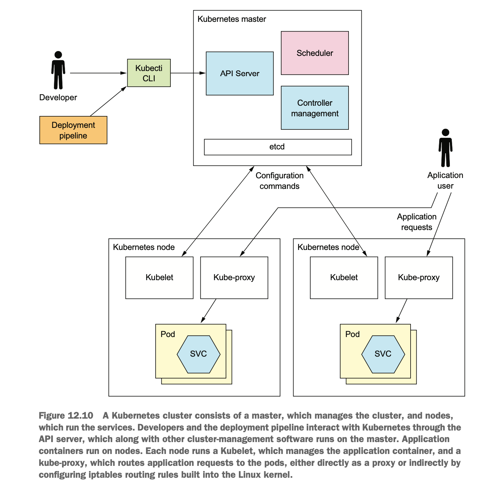

# 12. Deploying Microservices

## 배포
- 배포: 운영 환경에 서비스하기
  - 절차: 해야하는 작업
  - 구조: 소프트웨어가 동작하는 환경
- 역사
  - 절차
    - 과거: 개발팀과 운영팀이 분리
    - 요즘: DevOps - 개발자가 배포, 운영도 한다
  - 구조
    - PM -> VM -> container, serverless
    - 2000년대 중반: apache tomcat, jetty

- 운영 환경에서 필요한 기능 4가지
  - 서비스를 쉽게 생성/변경할 수 있는 인터페이스
    (이상적으로는 REST API와 이것을 호출하는 cli, gui)
  - 서비스의 정상 동작 보장
    - crash나 비정상 동작시 자동 재시작 시도
  - 모니터링
    - 개발자가 app의 상태 확인 가능, 이상 발생 시 알람
  - 사용자의 request -> 서비스로 라우팅

- 앞으로 소개할 4가지 배포 방식
  - language specific
  - virtual machine
  - container: docker, k8s
  - serverless: lambda


## 언어에 특정된 패키징
- 배포 단위가 언어에 특정된 패키징
  - java: 실행 가능한 jar file, war
  - nodejs: 소스 코드와 모듈
  - golang: os specific executable
- 배포 방법
  - 0\. 사전 준비) 서버에 runtime 설치(ex. jvm)
  - 1\. 서버에 패키지(파일)을 옮긴다.
  - 2\. 파일을 실행한다



### 배포 후 실행 모습
- 서비스: 하나 이상의 프로세스로 구성된다
- 유형
  - 1개의 서버에 여러 서비스 인스턴스 배포
  - 1개의 프로스세스로 여러 개의 서비스 인스턴스가 배포되는 형태 \
    전통적이고 무거운 application의 경우 이 방식을 사용한다
  - ...


### 장점
- 배포가 빠르다
  - 배포 파일 복사 후 run
  - executable 파일만 서버로 이동하므로, 네트워크로 이동하는 데이터가 적다
- 효율적인 자원 사용
  - 1개의 서버 / 프로세스에서 여러 개의 인스턴스가 동작한다 \
  무거운 app일수록 더 장점이 된다.

### 단점
- 기술 스택의 캡슐화 X
  - 배포자도 언어에 특정되는 기술 스택을 알아야 한다.
- 자원 제한 불가
  - 서비스 별로 자원 제한을 할 수 없어, 한 서비스가 과점/독점할 수 있다
- 서비스간 격리 X
  - 여러 서비스가 한 머신에서 격리되지 않은 상태로 존재하기 때문에, 한 서비스의 문제가 다른 서비스에 영향을 줄 수 있다.
- 배포 위치 결정이 어렵다
  - 서버의 가용량과 서비스가 필요한 자원을 직접 파악해서, 배포할 서버를 선택해야 한다.

## vm(virtual machine)
- 배포 단위가 vm. \
  = 서비스 1개마다 1개의 vm을 만든다.
- vmi(virtual machine image)로 vm을 생성한다.
  - vmi: virtual machine 환경 설정 + service code
  - ex) animator packer
  - packer의 machine image 설명
    - vm을 빠르게 생성,실행하기 위한 static unit
    - os + os 설정 + software를 포함한다.
    - platform마다 형식이 다르다.  \
    AMIs(Amazon EC2), VMDK/VMX files(VMware), OVF exports(VirtualBox), ...

  > A machine image is a single static unit that contains a pre-configured operating system and installed software which is used to quickly create new running machines. Machine image formats change for each platform. Some examples include AMIs for EC2, VMDK/VMX files for VMware, OVF exports for VirtualBox, etc.



### 장점
- 기술 스택의 캡슐화
  - 배포자는 application의 기술 스택을 몰라도 된다
  (vmi에 포함되어 있음)
  - 서비스 배포 API = vm 배포 API
- 서비스 격리
  - 서비스는 각각 다른 vm에 있으며,
  - vm 별로 cpu, memory를 제한할 수 있다.
- cloud 환경을 이용할 수 있고, cloud에서 제공하는 여러 유용한 기능을 사용할 수 있다.

### 단점
- 상대적으로 비효율적인 자원 사용
  - application 1개 = vm 1개 이다보니, nodejs, go 처럼 가벼운 앱에게는 비효율적이다
- 상대적으로 배포가 느리다
  - 네트워크로 전송하는 데이터가 크다
  - vm 구동 시간, ..
- os와 runtime을 직접 관리해야하는 부담

## container
- os 수준의 가상화
- 프로세스 입장에서는
  - 일반 머신에서 동작하는 것처럼 보인다
  - container마다 ip가 부여되므로, port 충돌 우려가 없다/
- container 별로 cpu, memory, .. 제한 가능
- 가장 유명한 것: docker

https://www.ais.com/an-overview-of-kubernetes-and-k8-clusters/

### docker 살펴보기
- container image
  - filesystem image: application + 필요한 software(jdk,, ...)
- Dockerfile
  - container image 레시피

    ```Dockerfile
    FROM openjdk:8u171-jre-alpine # base image
    RUN apk --no-cache add curl # install supporting software
    CMD java ${JAVA_OPTS} -jar ftgo-restaurant-service.jar # run application when container starts
    HEALTHCHECK --start-period=30s -- interval=5s CMD curl http://localhost:8080/actuator/health || exit 1
    COPY build/libs/ftgo-restaurant-service.jar . # copy application to image
    ```
- Docker image
  - build
    ```bash
    cd ftgo-restaurant-service
    ../gradlew assemble
    docker build -t ftgo-restaurant-service
    ```
  - push to registry
    - registry: docker image의 cloud storage/marketplace
    ```bash
    docker tag ftgo-restaurant-service registry.acme.com/ftgo-restaurant-service:1.0.0.RELEASE
    ```
  - layered file system: 변경된 부분만 전송 -> 효율적

- run docker container
  - pull image from the registry & start
  ```bash
  docker run \
    -d  \ # as background
  --name ftgo-restaurant-service  \ # name of the container
  -p 8082:8080  \ # port binding with the host
  -e SPRING_DATASOURCE_URL=... -e SPRING_DATASOURCE_USERNAME=...  \ # environment variables
  -e SPRING_DATASOURCE_PASSWORD=... \
  registry.acme.com/ftgo-restaurant-service:1.0.0.RELEASE # image to run
  ```
- docker의 아쉬운 점
  - container crash시 자동 재시작 X
  - app이 의존하는 여러 component를 관리하기가 어렵다(ex. DB, kafka, ...) \
    => `Docker Compose` : containers를 그룹으로 관리해서, start/stop 가능. \
    하지만, 여전히 단일 머신이라는 한계가 있다

### 장점
- build가 빠르다
- 기술 스택의 캡슐화
  - 배포자는 application의 기술 스택을 몰라도 된다
  - 서비스 관리 API = container API
- 서비스 인스턴스의 격리
- 서비스별 자원 제한 가능

### 단점
- container image 관리가 필요하다
- container infra (어쩌면 vm infra까지)를 관리해야한다

## kubernetes(k8s)
- Kubernetes는 ~~Docker~~ container orchestration framework \
  -> docker 이외의 runtime도 지원. v1.24 전까지 Docker container runtime이 내장함
  - orchestration? orchestra! \
    여러 container가 조화롭게(?) 지낼 수 있도록
    - 쉽게 서비스 배포, rollback
    - cpu 등 자원 관리
    - 다른 서비스 쉽게 찾기(service discovery)
  - docker swarm은 패배

- k8s cluster
  - 1개 이상의 서버를 cluster라는 단위로 묶어서 관리한다 \
    Docker compose와 다른점.
  - 서버 = node라고 부른다.(PM/VM)
  - 지휘자가 필요하다(like zookeeper)
    - control plane, master
    - 관리 모듈
    - 회사의 운영진
  - 일개미가 필요하다
    - data plane
    - 회사의 실무 부서
- 선언적 방식
  - 원하는 상태를 요청한다
  - ex) pod을 늘려주세요 (X) -> pod이 2개가 되게 해주세요 (O)
    - 지금 pod이 3개라면 -> 1개 삭제
    - 지금 pod이 1개라면 -> 1개 추가 생성
    ```yaml
    apiVersion: apps/v1
    kind: Deployment
    metadata:
      name: nginx-deployment
      labels:
        app: nginx
    spec:
      replicas: 2
      selector:
        matchLabels:
          app: nginx
      template:
        metadata:
          labels:
            app: nginx
        spec:
          containers:
          - name: nginx
            image: nginx:1.14.2
            ports:
            - containerPort: 80
    ```
### architecture


https://devtron.ai/blog/kubernetes-architecture-the-ultimate-guide/



- k8s의 단위: cluster
- 용어
  - pod: 배포 단위. 1개 이상의 container로 구성
  - machine은 master 또는 node
  - master: cluster 관리 역할. 적은 수
  - node: pod을 실행하는 worker 역할. 많은 수

- master component
  - k8s api-server
    - rest api server
    - cluster에 대한 요청(서비스 생성, 조회, 삭제, ...)을 받음
    - ex) kubectl(cli)
      ```bash
      kubectl get pod
      kubectl delete pod hello
      kubectl apply -f file.yaml # file 내용을 request body로 요청
      ```
  - etcd
    - key-value noSQL database. cluster 데이터 저장
    - 분산 DB
    - watch API: 데이터 변경 감지 & noti 가능
  - scheduler
    - pod 구동할 node 결정.
    - 어떤 node에 유휴 자원이 많은지, pod이 필요한 cpu, memory 등을 고려하여 배정
    - docker까지는 사람이 하던 일.
  - controller manager
    - run the controller
    - controller: 상태 모니터링. -> 정상성(?) 유지 노력 \
      ex) nginx이 있는 pod을 1개 생성해주세요 \
       - 처음에 잘 떠있다가 ?? 알 수 업는 이유로 nginx가 죽음
       - -> controller가 이걸 발견하고 재시작시키는 역할
    - 실제로는 더 다양한 처리를 한다.

- node components
  - kublet
    - pod 생성 및 관리
    - controller가 kublet한테 ~~해주세요 요청
  - kube-proxy
    - load balancing을 포함한 노드 내 네트워크 관리
      ex) iptable 변경
    - 다른 pod 찾아가기
  - pod: application services

### key concepts(resource)
- Pod
  - 배포의 기본 단위
  - 1개 이상의 container로 구성
  - pod 내에서 container는 ip 주소와 storage volume을 공유
  - ephemeral(임시)
- Deployment
  - pod을 관리하는 controller
  - deployment의 spec에 정의한 상태로 pod이 존재하도록 한다. \
    (ex. replicas:2 인데 pod이 1개이다 -> pod을 하나 더 생성해서 2개로 맞춘다)
- Service
  - app을 호출할 수 있는 안정적/고정적인 network 주소 제공.(DNS, IP)
  - k8s에서 pod은 쉽게 죽고 재생성되는 것이 기본 가정이기 때문에,
  pod의 ip를 직접 호출하지 않고, Service 를 생성해서 pod에 접근할 수 있는 고정 ip, dns를 부여한다
- ConfigMap
  - name-value pairs
- Secret
  - ConfigMap과 유사하나 비밀 정보를 넣는다. base64 암호화되어있다.


### 기능
- 자원 관리
  - 여러 node의 자원을 pool로 관리 -> 1개의 machine처럼 처리
  - container 별 cpu, memory 제한. 과점유 방지
- 스케쥴링
  - node의 상태를 파악하여, 여유있는 머신에 container를 자동 할당
- 서비스 관리
  - 서비스 이름과 versioning 개념
  - 서비스의 상태 보장
    - 장애 자동 복구(container의 health check)
    - 자동 scale in/out(hpa)
  - 다른 service와/로의 통신(service discovery, load balancing),
- 무중단, 안전한 배포
  - rolling update, rollback 제공한다
  - 방법
    - build & push image
    - edit k8s yaml & apply
    - -> 신규 pod이 생성, 오래된 pod 삭제된다.
  - 그런데 canary 배포, A/B testing은 불가능하다.. \
    -> ingress 이용 필요


```yaml
apiVersion: autoscaling/v2
kind: HorizontalPodAutoscaler
metadata:
  name: php-apache
spec:
  scaleTargetRef:
    apiVersion: apps/v1
    kind: Deployment
    name: php-apache
  minReplicas: 1
  maxReplicas: 10
  metrics:
  - type: Resource
    resource:
      name: cpu
      target:
        type: Utilization
        averageUtilization: 50
status:
  observedGeneration: 1
  lastScaleTime: <some-time>
  currentReplicas: 1
  desiredReplicas: 1
  currentMetrics:
  - type: Resource
    resource:
      name: cpu
      current:
        averageUtilization: 0
        averageValue: 0
```


### 아쉬운 점
- LoadBalancer
  - 존재는 하는데 기능이 아쉽다. ex) canary 배포 안됨
  - AWS ELB, ... 등으로 대체 가능


## service mesh
- mesh: 망. 그물망.
- network = net + work
- 여러 service 사이의 통신 관리(MSA 환경에 적합)
  - 대표: istio

### istio
- 기능
  - https://istio.io/latest/docs/overview/what-is-istio/
  - rule based load balancing, 여러 버전의 서비스 배포
  - 보안
      - mTLS
      - 호출(=통신) 권한 제어(인증 인가)
  - 트래픽 관리
      - load balancing
      - routing rule, retry, failover, circuit breaker
      - quota & rate limiting
  - observability
      - metric, access log, trace 기능

- istio 구조
  - istiod
    - control plane
    - rest api-server, config server, telemetry, ...
  - envoy proxy(side car)
    - application pod에 sidecar로 생성
    - pod 내부 <-> 외부의 traffic을 가로채서 뭔가를 더 한다
      ex) header 추가, 인증인가, access logging, ...
    - 뭘 더할지는 istiod가 알려준다. file로도 설정 가능
  - envoy proxy(ingress)
    - service mesh 내부로 들어오는 traffic을 제어하는 api-gateway
  - envoy proxy(egress)
    - service mesh 외부로 나가는 traffic을 제어하는 api-gateway
- envoy
  - 사실 istio와 독립적인 프로젝트
  - istio가 envoy를 활용한 거다. vm에도 설치 가능
  - envoy는 lyft가 만듦.

## TODO
- k8s sample, istio sample
