# 12. Deploying Microservices

## 배포
- 배포: 운영 환경에 서비스하기
  - 절차: 해야하는 작업
  - 구조: 소프트웨어가 동작하는 환경
- 역사
  - 절차
    - 과거: 개발팀과 운영팀이 분리
    - 요즘: DevOps - 개발자가 배포, 운영도 한다
  - 구조
    - PM -> VM -> container, serverless
    - 2000년대 중반: apache tomcat, jetty

- 운영 환경에서 필요한 기능 4가지
  - 서비스를 쉽게 생성/변경할 수 있는 인터페이스
    (이상적으로는 REST API와 이것을 호출하는 cli, gui)
  - 서비스의 정상 동작 보장
    - crash나 비정상 동작시 자동 재시작 시도
  - 모니터링
    - 개발자가 app의 상태 확인 가능, 이상 발생 시 알람
  - 사용자의 request -> 서비스로 라우팅

- 앞으로 소개할 4가지 배포 방식
  - language specific
  - virtual machine
  - container: docker, k8s
  - serverless: lambda


## 언어에 특정된 패키징
- 배포 단위가 언어에 특정된 패키징
  - java: 실행 가능한 jar file, war
  - nodejs: 소스 코드와 모듈
  - golang: os specific executable
- 배포 방법
  - 0\. 사전 준비) 서버에 runtime 설치(ex. jvm)
  - 1\. 서버에 패키지(파일)을 옮긴다.
  - 2\. 파일을 실행한다

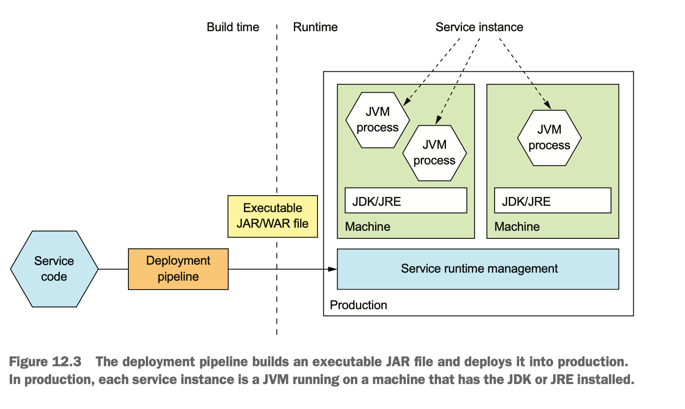

### 배포 후 실행 모습
- 서비스: 하나 이상의 프로세스로 구성된다
- 유형
  - 1개의 서버에 여러 서비스 인스턴스 배포
  - 1개의 프로스세스로 여러 개의 서비스 인스턴스가 배포되는 형태 \
    전통적이고 무거운 application의 경우 이 방식을 사용한다
  - ...
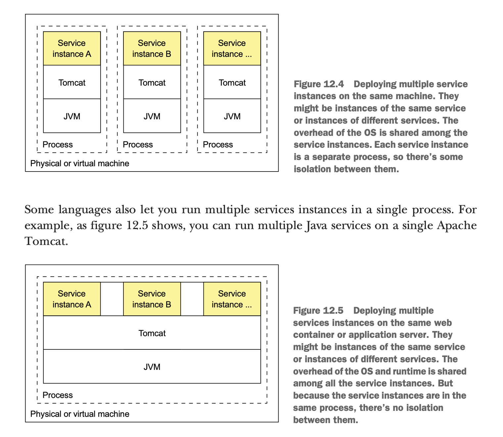

### 장점
- 배포가 빠르다
  - 배포 파일 복사 후 run
  - executable 파일만 서버로 이동하므로, 네트워크로 이동하는 데이터가 적다
- 효율적인 자원 사용
  - 1개의 서버 / 프로세스에서 여러 개의 인스턴스가 동작한다 \
  무거운 app일수록 더 장점이 된다.

### 단점
- 기술 스택의 캡슐화 X
  - 배포자도 언어에 특정되는 기술 스택을 알아야 한다.
- 자원 제한 불가
  - 서비스 별로 자원 제한을 할 수 없어, 한 서비스가 과점/독점할 수 있다
- 서비스간 격리 X
  - 여러 서비스가 한 머신에서 격리되지 않은 상태로 존재하기 때문에, 한 서비스의 문제가 다른 서비스에 영향을 줄 수 있다.
- 배포 위치 결정이 어렵다
  - 서버의 가용량과 서비스가 필요한 자원을 직접 파악해서, 배포할 서버를 선택해야 한다.

## vm(virtual machine)
- 배포 단위가 vm. \
  = 서비스 1개마다 1개의 vm을 만든다.
- vmi(virtual machine image)로 vm을 생성한다.
  - vmi: virtual machine 환경 설정 + service code
  - ex) animator packer
  - packer의 machine image 설명
    - vm을 빠르게 생성,실행하기 위한 static unit
    - os + os 설정 + software를 포함한다.
    - platform마다 형식이 다르다.  \
    AMIs(Amazon EC2), VMDK/VMX files(VMware), OVF exports(VirtualBox), ...

  > A machine image is a single static unit that contains a pre-configured operating system and installed software which is used to quickly create new running machines. Machine image formats change for each platform. Some examples include AMIs for EC2, VMDK/VMX files for VMware, OVF exports for VirtualBox, etc.

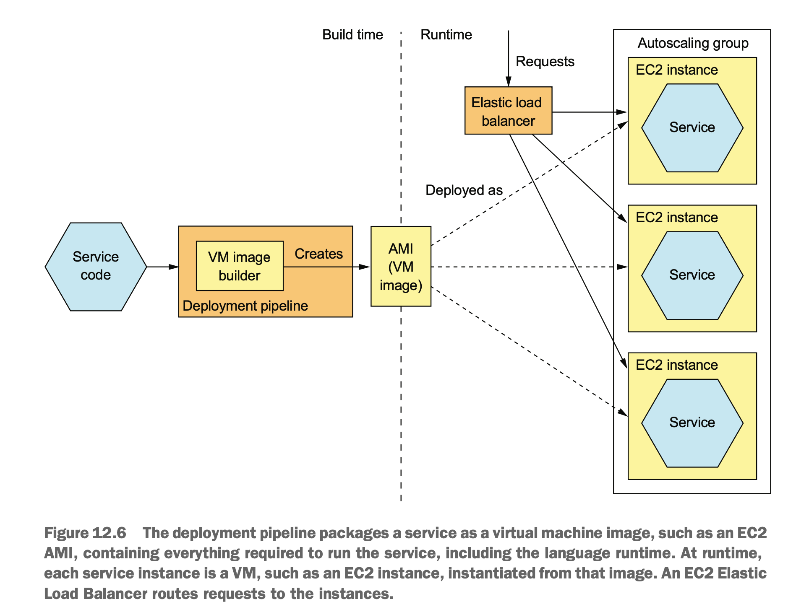

### 장점
- 기술 스택의 캡슐화
  - 배포자는 application의 기술 스택을 몰라도 된다
  (vmi에 포함되어 있음)
  - 서비스 배포 API = vm 배포 API
- 서비스 격리
  - 서비스는 각각 다른 vm에 있으며,
  - vm 별로 cpu, memory를 제한할 수 있다.
- cloud 환경을 이용할 수 있고, cloud에서 제공하는 여러 유용한 기능을 사용할 수 있다.

### 단점
- 상대적으로 비효율적인 자원 사용
  - application 1개 = vm 1개 이다보니, nodejs, go 처럼 가벼운 앱에게는 비효율적이다
- 상대적으로 배포가 느리다
  - 네트워크로 전송하는 데이터가 크다
  - vm 구동 시간, ..
- os와 runtime을 직접 관리해야하는 부담

## container
- os 수준의 가상화
- 프로세스 입장에서는
  - 일반 머신에서 동작하는 것처럼 보인다
  - container마다 ip가 부여되므로, port 충돌 우려가 없다/
- container 별로 cpu, memory, .. 제한 가능
- 가장 유명한 것: docker
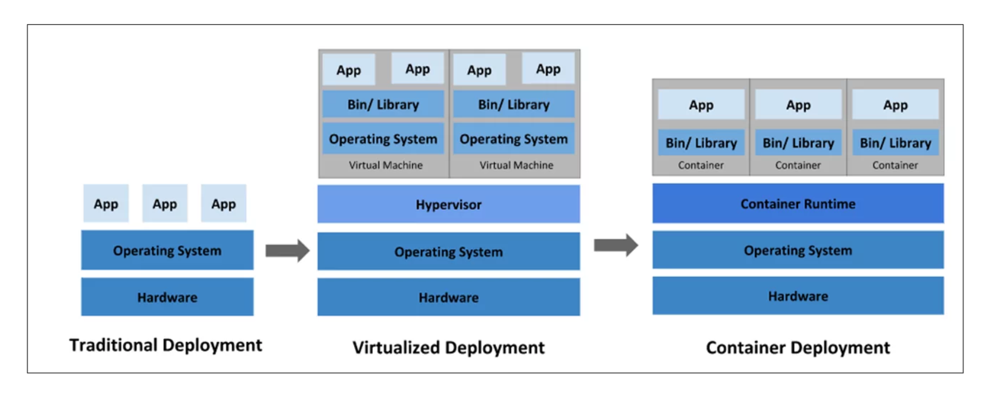
https://www.ais.com/an-overview-of-kubernetes-and-k8-clusters/

### docker 살펴보기
- container image
  - filesystem image: application + 필요한 software(jdk,, ...)
- Dockerfile
  - container image 레시피

    ```Dockerfile
    FROM openjdk:8u171-jre-alpine # base image
    RUN apk --no-cache add curl # install supporting software
    CMD java ${JAVA_OPTS} -jar ftgo-restaurant-service.jar # run application when container starts
    HEALTHCHECK --start-period=30s -- interval=5s CMD curl http://localhost:8080/actuator/health || exit 1
    COPY build/libs/ftgo-restaurant-service.jar . # copy application to image
    ```
- Docker image
  - build
    ```bash
    cd ftgo-restaurant-service
    ../gradlew assemble
    docker build -t ftgo-restaurant-service
    ```
  - push to registry
    - registry: docker image의 cloud storage/marketplace
    ```bash
    docker tag ftgo-restaurant-service registry.acme.com/ftgo-restaurant-service:1.0.0.RELEASE
    ```
  - layered file system: 변경된 부분만 전송 -> 효율적

- run docker container
  - pull image from the registry & start
  ```bash
  docker run \
    -d  \ # as background
  --name ftgo-restaurant-service  \ # name of the container
  -p 8082:8080  \ # port binding with the host
  -e SPRING_DATASOURCE_URL=... -e SPRING_DATASOURCE_USERNAME=...  \ # environment variables
  -e SPRING_DATASOURCE_PASSWORD=... \
  registry.acme.com/ftgo-restaurant-service:1.0.0.RELEASE # image to run
  ```
- docker의 아쉬운 점
  - container crash시 자동 재시작 X
  - app이 의존하는 여러 component를 관리하기가 어렵다(ex. DB, kafka, ...) \
    => `Docker Compose` : containers를 그룹으로 관리해서, start/stop 가능. \
    하지만, 여전히 단일 머신이라는 한계가 있다

### 장점
- build가 빠르다
- 기술 스택의 캡슐화
  - 배포자는 application의 기술 스택을 몰라도 된다
  - 서비스 관리 API = container API
- 서비스 인스턴스의 격리
- 서비스별 자원 제한 가능

### 단점
- container image 관리가 필요하다
- container infra (어쩌면 vm infra까지)를 관리해야한다

## kubernetes(k8s)
- Kubernetes는 ~~Docker~~ container orchestration framework \
  -> docker 이외의 runtime도 지원. v1.24 전까지 Docker container runtime이 내장함
  - orchestration? orchestra! \
    여러 container가 조화롭게(?) 지낼 수 있도록
    - 쉽게 서비스 배포, rollback
    - cpu 등 자원 관리
    - 다른 서비스 쉽게 찾기(service discovery)
  - docker swarm은 패배

- k8s cluster
  - 1개 이상의 서버를 cluster라는 단위로 묶어서 관리한다 \
    Docker compose와 다른점.
  - 서버 = node라고 부른다.(PM/VM)
  - 지휘자가 필요하다(like zookeeper)
    - control plane, master
    - 관리 모듈
    - 회사의 운영진
  - 일개미가 필요하다
    - data plane
    - 회사의 실무 부서
- 선언적 방식
  - 원하는 상태를 요청한다
  - ex) pod을 늘려주세요 (X) -> pod이 2개가 되게 해주세요 (O)
    - 지금 pod이 3개라면 -> 1개 삭제
    - 지금 pod이 1개라면 -> 1개 추가 생성
    ```yaml
    apiVersion: apps/v1
    kind: Deployment
    metadata:
      name: nginx-deployment
      labels:
        app: nginx
    spec:
      replicas: 2
      selector:
        matchLabels:
          app: nginx
      template:
        metadata:
          labels:
            app: nginx
        spec:
          containers:
          - name: nginx
            image: nginx:1.14.2
            ports:
            - containerPort: 80
    ```
### architecture

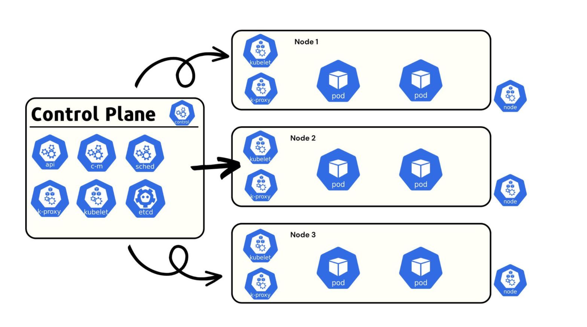
https://devtron.ai/blog/kubernetes-architecture-the-ultimate-guide/


- k8s의 단위: cluster
- 용어
  - pod: 배포 단위. 1개 이상의 container로 구성
  - machine은 master 또는 node
  - master: cluster 관리 역할. 적은 수
  - node: pod을 실행하는 worker 역할. 많은 수

- master component
  - k8s api-server
    - rest api server
    - cluster에 대한 요청(서비스 생성, 조회, 삭제, ...)을 받음
    - ex) kubectl(cli)
      ```bash
      kubectl get pod
      kubectl delete pod hello
      kubectl apply -f file.yaml # file 내용을 request body로 요청
      ```
  - etcd
    - key-value noSQL database. cluster 데이터 저장
    - 분산 DB
    - watch API: 데이터 변경 감지 & noti 가능
  - scheduler
    - pod 구동할 node 결정.
    - 어떤 node에 유휴 자원이 많은지, pod이 필요한 cpu, memory 등을 고려하여 배정
    - docker까지는 사람이 하던 일.
  - controller manager
    - run the controller
    - controller: 상태 모니터링. -> 정상성(?) 유지 노력 \
      ex) nginx이 있는 pod을 1개 생성해주세요 \
       - 처음에 잘 떠있다가 ?? 알 수 업는 이유로 nginx가 죽음
       - -> controller가 이걸 발견하고 재시작시키는 역할
    - 실제로는 더 다양한 처리를 한다.

- node components
  - kublet
    - pod 생성 및 관리
    - controller가 kublet한테 ~~해주세요 요청
  - kube-proxy
    - load balancing을 포함한 노드 내 네트워크 관리
      ex) iptable 변경
    - 다른 pod 찾아가기
  - pod: application services

### key concepts(resource)
- Pod
  - 배포의 기본 단위
  - 1개 이상의 container로 구성
  - pod 내에서 container는 ip 주소와 storage volume을 공유
  - ephemeral(임시)
  ```bash
  $ kubectl get pods
  NAME                             READY     STATUS    RESTARTS   AGE
  details-v1-1520924117-48z17      2/2       Running   0          6m
  productpage-v1-560495357-jk1lz   2/2       Running   0          6m
  ratings-v1-734492171-rnr5l       2/2       Running   0          6m
  reviews-v1-874083890-f0qf0       2/2       Running   0          6m
  reviews-v2-1343845940-b34q5      2/2       Running   0          6m
  reviews-v3-1813607990-8ch52      2/2       Running   0          6m
  ```
- Deployment
  - pod을 관리하는 controller
  - deployment의 spec에 정의한 상태로 pod이 존재하도록 한다. \
    (ex. replicas:2 인데 pod이 1개이다 -> pod을 하나 더 생성해서 2개로 맞춘다)
  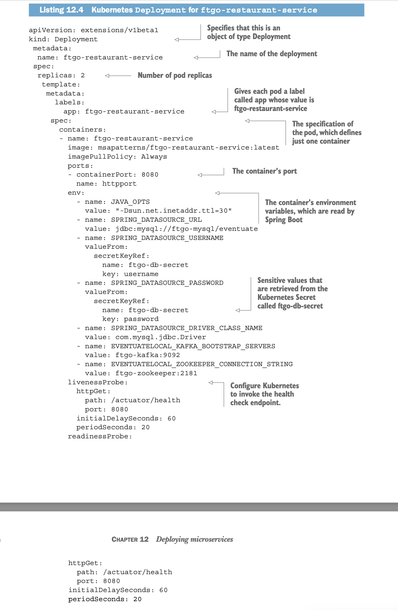

- Service
  - app을 호출할 수 있는 안정적/고정적인 network 주소 제공.(DNS, IP)
  - k8s에서 pod은 쉽게 죽고 재생성되는 것이 기본 가정이기 때문에,
  pod의 ip를 직접 호출하지 않고, Service 를 생성해서 pod에 접근할 수 있는 고정 ip, dns를 부여한다

  ```bash
  $ kubectl get services
  NAME          TYPE        CLUSTER-IP   EXTERNAL-IP   PORT(S)    AGE
  details       ClusterIP   10.0.0.31    <none>        9080/TCP   6m
  kubernetes    ClusterIP   10.0.0.1     <none>        443/TCP    7d
  productpage   ClusterIP   10.0.0.120   <none>        9080/TCP   6m
  ratings       ClusterIP   10.0.0.15    <none>        9080/TCP   6m
  reviews       ClusterIP   10.0.0.170   <none>        9080/TCP   6m
  ```
- ConfigMap
  - name-value pairs
- Secret
  - ConfigMap과 유사하나 비밀 정보를 넣는다. base64 암호화되어있다.


### 기능
- 자원 관리
  - 여러 node의 자원을 pool로 관리 -> 1개의 machine처럼 처리
  - container 별 cpu, memory 제한. 과점유 방지
- 스케쥴링
  - node의 상태를 파악하여, 여유있는 머신에 container를 자동 할당
- 서비스 관리
  - 서비스 이름과 versioning 개념
  - 서비스의 상태 보장
    - 장애 자동 복구(container의 health check)
    - 자동 scale in/out(hpa)
  - 다른 service와/로의 통신(service discovery, load balancing),
- 무중단, 안전한 배포
  - rolling update, rollback 제공한다
  - 방법
    - build & push image
    - edit k8s yaml & apply
    - -> 신규 pod이 생성, 오래된 pod 삭제된다.
  - 그런데 canary 배포, A/B testing은 불가능하다.. \
    -> ingress 이용 필요


```yaml
apiVersion: autoscaling/v2
kind: HorizontalPodAutoscaler
metadata:
  name: php-apache
spec:
  scaleTargetRef:
    apiVersion: apps/v1
    kind: Deployment
    name: php-apache
  minReplicas: 1
  maxReplicas: 10
  metrics:
  - type: Resource
    resource:
      name: cpu
      target:
        type: Utilization
        averageUtilization: 50
status:
  observedGeneration: 1
  lastScaleTime: <some-time>
  currentReplicas: 1
  desiredReplicas: 1
  currentMetrics:
  - type: Resource
    resource:
      name: cpu
      current:
        averageUtilization: 0
        averageValue: 0
```


### 아쉬운 점
- LoadBalancer
  - 존재는 하는데 기능이 아쉽다. ex) canary 배포 안됨
  - AWS ELB, ... 등으로 대체 가능


## service mesh
- mesh: 망. 그물망.
- network = net + work
- 여러 service 사이의 통신 관리(MSA 환경에 적합)
  - 대표: istio

### istio

#### 기본 방식
- service 앞에 proxy를 두어서(=sidecar) \
  service로 들어가는/나가는 traffic을 proxy가 먼저 처리하는 방식
  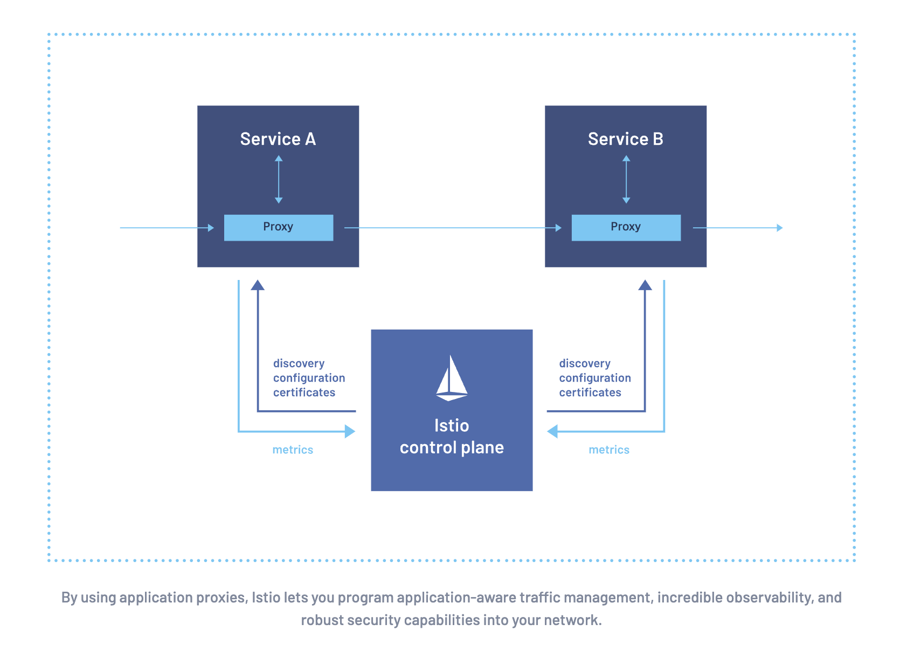
- k8s 환경에서는 1개의 pod에
  - 나의(?) app container와
  - isio가 관리하는 `istio-proxy` container
  ```yaml
  apiVersion: v1
  kind: Pod
  metadata:
    name: example
  spec:
    containers:
    - name: my-app
      image: nginx
    - name: istio-proxy
      image: docker.io/istio/proxyv2:1.24.0 # 가장 최신
      resources:
        requests:
          cpu: "100m"
      volumeMounts:
      - mountPath: /etc/certs
        name: certs
      lifecycle:
        preStop:
          exec:
            command: ["curl", "10"]
    volumes:
    - name: certs
      secret:
        secretName: istio-certs
  ```

#### istio 구조

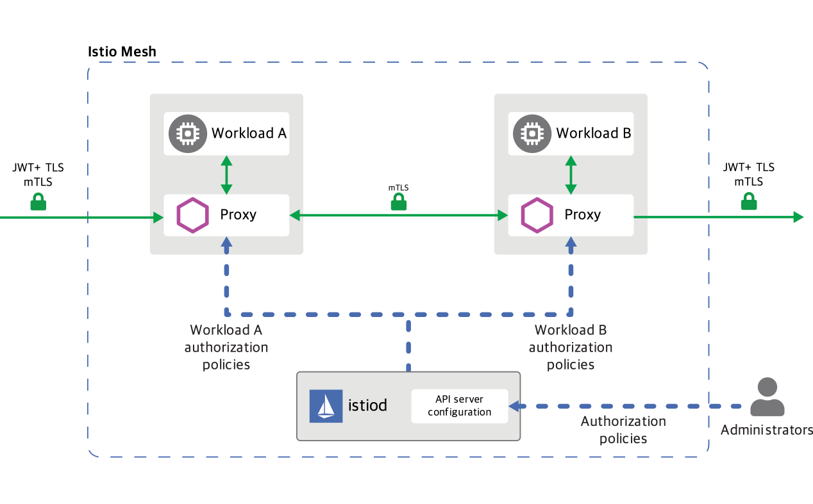
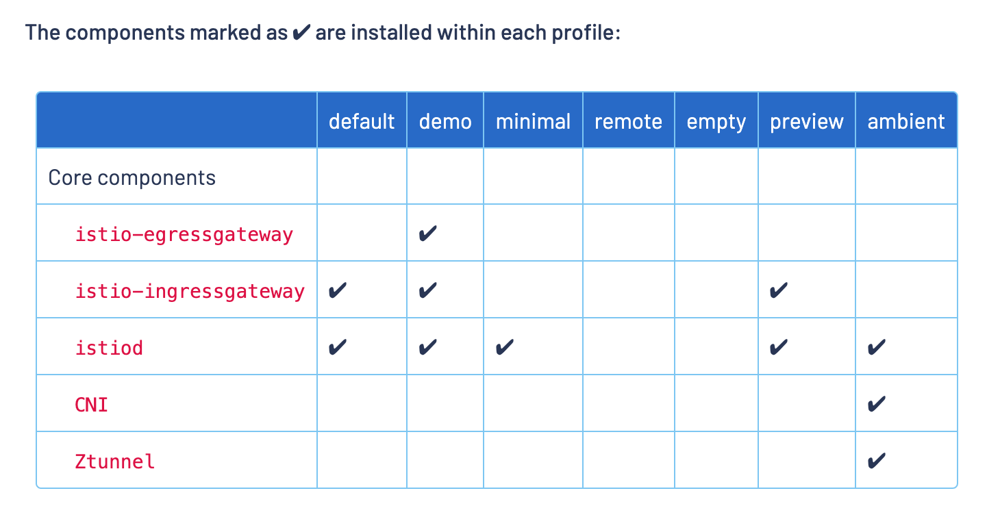
https://istio.io/latest/docs/setup/additional-setup/config-profiles/

- demo와 그래프
  https://istio.io/latest/docs/examples/bookinfo/
  https://istio.io/latest/docs/setup/getting-started/kiali-example2.png

- envoy proxy(side car)
  - application pod에 sidecar로 생성(=istio-proxy)
  - pod 내부 <-> 외부의 traffic을 가로채서 뭔가 처리한다 \
    ex) header 추가, 인증인가, access logging, ...
  - config는 istiod로부터 가져오거나 file로도 설정 가능
- istiod
  - control plane
  - rest api-server, config server, telemetry, ...
- envoy proxy(ingress)
  - service mesh 내부로 들어오는 traffic을 제어하는 api-gateway
- envoy proxy(egress)
  - service mesh 외부로 나가는 traffic을 제어하는 api-gateway
- envoy
  - istio와 독립적인 프로젝트. envoy는 lyft가 만듦
    - k8s에서 docker container를 활용한 것처럼, istio에서 enovy를 활용
  - envoy는 vm에도 설치 가능


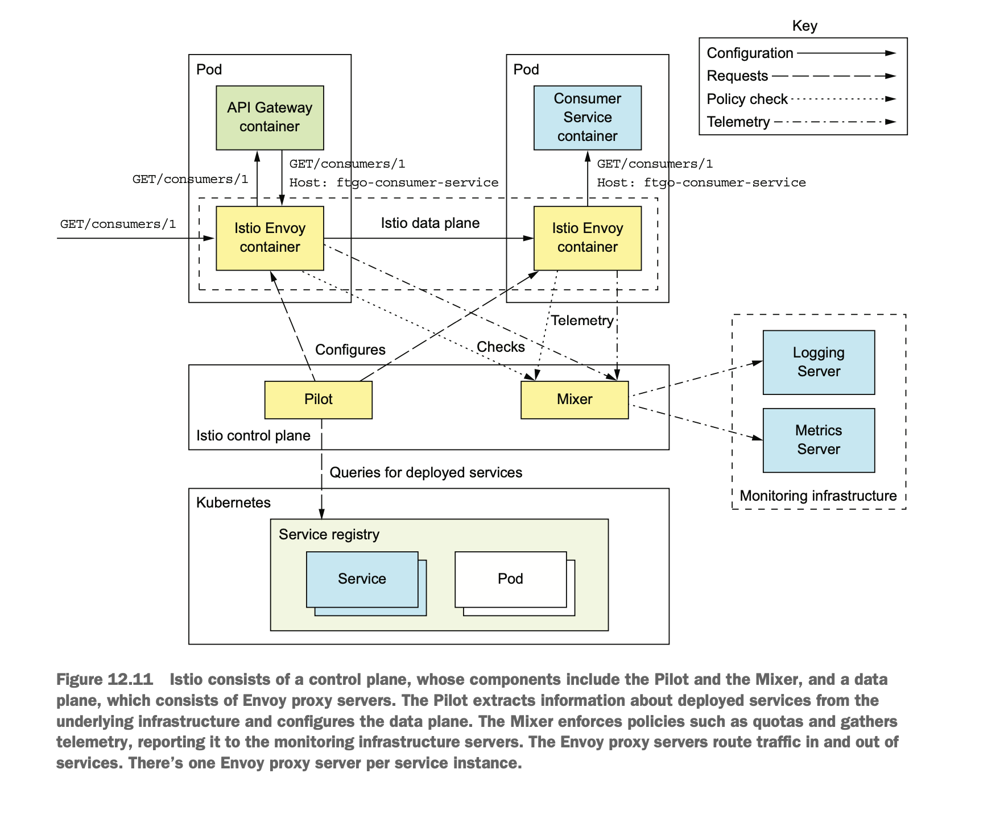


#### 기능
- https://istio.io/latest/docs/overview/what-is-istio/
- 규칙 기반 load balancing, 여러 버전의 서비스 연결(ex. v1은 app-v1, v2는 app-v2)
- 트래픽 관리
    - load balancing
    - routing rule, retry, failover, circuit breaker
    - quota & rate limiting
  ```yaml
  apiVersion: networking.istio.io/v1
  kind: VirtualService
  metadata:
    name: bookinfo
  spec:
    hosts:
      - bookinfo.com
    http:
    - match:
      - uri:
          prefix: /hello
      route:
      - destination:
          host: hello
    - match:
      - uri:
          prefix: /bye
      route:
      - destination:
          host: bye
    - match:
      - uri:
          prefix: /ab-testing
      route: # review v1: review v2 = 75:25
      - destination:
          host: reviews
          subset: v1
        weight: 75
      - destination:
          host: reviews
          subset: v2
        weight: 25
  - match:
    - headers:
        user-name:
          prefix: "test-user-" # header value match로 routing
    route:
    - destination:
        host: sample-canary
        subset: v2
  ```
- 보안
    - mTLS
      - mTLS: mutalTLS(상호 TLS)
        - tls: 서버가 인증서로 본인의 신원을 증명
        - mTLS: 클라이언트와 서버 모두 본인의 신원을 인증서로 증명 \
          -> 클라이언트도, 서버도 인증서를 가져야한다
        - istio는 [self-signed 인증서를 발급하고 자동 갱신](https://istio.io/latest/docs/tasks/security/cert-management/plugin-ca-cert/)한다.
          - control plane: 인증서 서명, CA 역할
          - data plane에 있는 proxy는 서명된 인증서를 받고, 자동으로 갱신한다.
          - self-signed 인증서이기 때문에, service mesh 내부에서만 인정되는(?) 인증서이다
      - https://istio.io/latest/docs/reference/config/security/peer_authentication/
      ```yaml
      apiVersion: security.istio.io/v1
      kind: PeerAuthentication
      metadata:
        name: default
        namespace: foo
      spec:
        mtls:
          mode: STRICT # 여기 두 줄
      ```
    - 호출(=통신) 권한 제어(인증 인가)

      ```yaml
      apiVersion: security.istio.io/v1
      kind: AuthorizationPolicy
      metadata:
        name: httpbin
        namespace: foo
      spec:
        selector:
          matchLabels:
            app: httpbin
            version: v1
      action: ALLOW
      rules:
        - to:
          - operation:
              paths: ["/test/*", "*/info"]
        - from:
          - source:
            principals: ["cluster.local/ns/default/sa/curl"]
          - source:
            namespaces: ["dev"]
          to:
          - operation:
            methods: ["GET"]
          when:
          - key: request.auth.claims[iss]
            values: ["https://accounts.google.com"]
      ```
      ```yaml
      apiVersion: security.istio.io/v1
      kind: AuthorizationPolicy
      metadata:
        name: httpbin-deny
        namespace: foo
      spec:
        selector:
          matchLabels:
            app: httpbin
            version: v1
      action: DENY
      rules:
        - from:
          - source:
            notNamespaces: ["foo"]
      ```

  - observability
      - metric, access log, trace 기능
        - envoy or istio가 자동 생성하는 metric
          ```
          envoy_cluster_internal_upstream_rq{response_code_class="2xx",cluster_name="xds-grpc"} 7163
          envoy_cluster_upstream_rq_completed{cluster_name="xds-grpc"} 7164
          envoy_cluster_ssl_connection_error{cluster_name="xds-grpc"} 0
          envoy_cluster_lb_subsets_removed{cluster_name="xds-grpc"} 0
          envoy_cluster_internal_upstream_rq{response_code="503",cluster_name="xds-grpc"} 1
          ```
          ```
          istio_requests_total{
            connection_security_policy="mutual_tls",
            destination_app="details",
            destination_canonical_service="details",
            destination_canonical_revision="v1",
            destination_principal="cluster.local/ns/default/sa/default",
            destination_service="details.default.svc.cluster.local",
            destination_service_name="details",
            destination_service_namespace="default",
            destination_version="v1",
            destination_workload="details-v1",
            destination_workload_namespace="default",
            reporter="destination",
            request_protocol="http",
            response_code="200",
            response_flags="-",
            source_app="productpage",
            source_canonical_service="productpage",
            source_canonical_revision="v1",
            source_principal="cluster.local/ns/default/sa/default",
            source_version="v1",
            source_workload="productpage-v1",
            source_workload_namespace="default"
          } 214
          ```
        - [access log](https://istio.io/latest/docs/tasks/observability/logs/access-log/)
          ```yaml
          apiVersion: telemetry.istio.io/v1
          kind: Telemetry
          metadata:
            name: mesh-default
            namespace: istio-system
          spec:
            accessLogging:
              - providers:
                - name: envoy
          ```
          ```log
          [2019-03-06T09:31:27.360Z] "GET /status/418 HTTP/1.1" 418 - "-" 0 135 5 2 "-" "curl/7.60.0" "d209e46f-9ed5-9b61-bbdd-43e22662702a" "httpbin:8000" "127.0.0.1:80" inbound|8000|http|httpbin.default.svc.cluster.local - 172.30.146.73:80 172.30.146.82:38618 outbound_.8000_._.httpbin.default.svc.cluster.local
          ```
        - [distributed tracing](https://istio.io/latest/about/faq/#how-envoy-based-tracing-works)
          - request마다 request id 와 trace header를 생성
            (X-B3-TraceId)
          - 이 데이터를 tracing backend(ex. Zipkin)로 수집(?) 해서 쉽게 활용할 수 있다

## serverless
- 이전까지는 pm/vm/container infra/k8s cluster/... 뭐든 관리가 필요함 \
관리 대상이 다를 뿐
- 대표적: AWS Lambda, apache openWhisk
- serverless deployment
  - AWS Lambda: 2014 AWS Re:Invent에서 소개
    - event driven service의 배포를 위한 것이었다
    - 동작 방식
      - application을 zip/jar로 만들어서 AWS Lambda에 업로드
      - request 발생시 어떤 함수를 실행시킬지 정의
      - 요청이 들어오면, AWS에서 자동으로 instance를 생성해서 요청을 처리한다
      - 요청 처리 시간과 memory를 기반으로 비용 지불


- architecture/동작
  - serverless platform의 동작 방식([OpenWhisk](https://github.com/apache/openwhisk/blob/master/docs/about.md#how-openWhisk-works))

  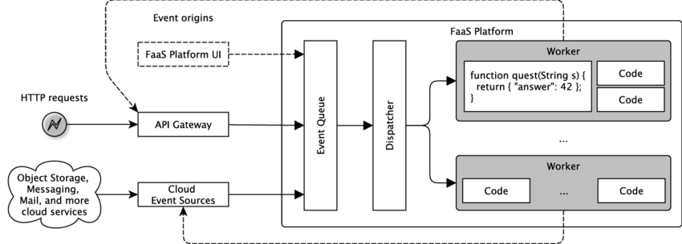
  > FaaS: Function as a Service

  https://www.researchgate.net/figure/Blueprint-of-a-serverless-platform-architecture-adapted-from-41_fig3_326423781


- lambda function - interface
  ```java
    public interface RequestHandler<I, O> {
              public O handleRequest(I input, Context context);
  }
  ```

- trigger
  - HTTP 요청
  - AWS 내 서비스에서 발생하는 event(ex. S3 버킷에 object가 생성됨, Dynamo DB에 update)
  - cron처럼 주기적 처리
  - lambda의 API 호출

- 장점
  - AWS의 다른 서비스와 연계가 쉬움
  - system 관리 작업 제거
  - 유연하다(요청이 많으면 AWS가 자동으로 instance를 늘려서 처리)
  - 사용량 기반 비용

- 단점
  - long tail latency
    - latency가 높은 경우가 종종 발생한다
    - ex. java 처럼 bootup 시간이 오래걸리는 경우
  - 이벤트/요청 기반 프로그래밍 모델의 한계
    - 오랜 시간동안 실행해야하는 작업에 적합하지 않다
