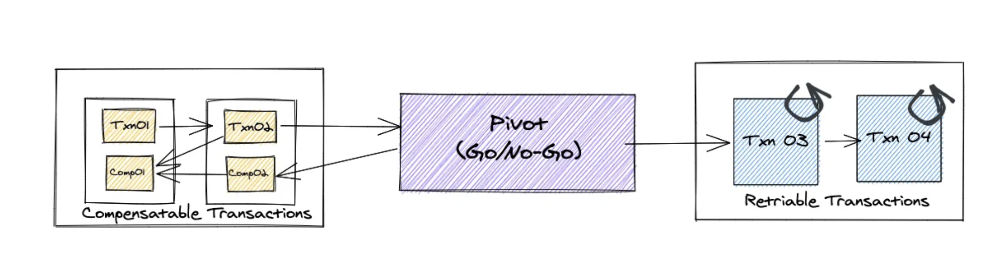

# 4. Managing transactions with sagas

- saga: message-driven sequence of local transactions
- application must use "contermeasure" - design techniques that prevent or reduce the impact of concurrency anomalies caused by the lack of isolation

## transaction management in a microservice architecture

### distributed transaction

- traditional approach
- de facto standard: X/Open Distributed Transaction Processing(DTP) Model. two-phase commit(2PC)
- trouble
  - many modern technologies do not support
  - it is a form of synchronous IPC -> reduces availability

### using saga pattern to maintain data consistency

- saga
  - sequence of local transactions
- challenge
  - lack of isolation
  - rollback
    - when some local transaction fails. the compensating transaction should be done

## coordinating saga

- choreography
  - distribute decision making and sequencing among the saga participants
  - primarily communicate by exchanging events
- orchestration
  - centralize saga's coordination logic in a saga orchestrator class. orchestrator sends command message to saga participants.

### choreography-based saga

- saga participants subscribe to each other's events and respond accordingly
- things to consider
  - database update and publishing of the event happen atomically
  - saga participant must be able to map each event that ist receives to its own data. event should contain correlation id
- benefits
  - simple
  - loose coupling: subscribe to events not participants
- drawbacks
  - more difficult to understand
  - cyclic dependencies between the services
  - risk of tight coupling
    - each saga participant need to subscribe to all events that affect them

### orchestration-based saga

- model as state machine
- benefits
  - simpler dependencies: no circular dependencies
  - less coupling: no need to know about saga participants
  - improves separation of concerns and simplifies the business logic
- drawbacks
  - risk of centralizing too much business logic in the orchestrator
    - to avoid this, design the orchestrator to solely responsible for sequencing and don't contain any other business logic

### recommendation

- use orchestrator

## handling the lack of isolation

- saga is lacks isolation thus is ACD
  - Atomicity - saga implementation ensures that all transactions are executed or all changes are undone
  - Consistency - referential integrity within a service is handled by database, across services is handled by the services
  - Durability - handled by local DB
- lack of isolation -> anomalies
  - anomalies: data read/write acts differently with the case when transactions were executed within a transaction
- in real world, DB supports low isolation level due to performance

### overview of anomalies

- lost updates
  - one saga overwrites without reading changes made by another saga
- dirty read
  - a transaction or a saga reads the updates made by a saga that has not yet completed those updates
- fuzzy/nonrepeatable reads
  - two different steps of a saga reads the same data and get different results because another saga has made updates

### countermeasures for handling isolation

- semantic lock: application level lock
  - set a flag in any record that it creates or updates
  - flag: either a lock that prevents other transactions from accessing or warns that it needs caution
  - how to handle a record with lock?
    - solution 1: fail and tell the client to retry later
      - benefit: simple to implement
      - drawback: client should implement retry logic
    - solution 2: block until the lock is released
    - benefit
      - recreating the isolation
      - remove the burden of retries from the client
    - drawback
      - application must manage locks
- commutative updates: design update operation to be executable in any order
- pessimistic view: reorder the steps of a saga to minimize business risk
- reread value: prevent dirty writes by rereading data to verify that its unchanged
- version file: record the updates to a record so that they can be reordered
- by value: use each request's business risk to dynamically select the concurrency mechanism
  - ex) low risk request -> use saga, high risk request -> use distributed transactions

### structure of a saga

> https://medium.com/@chinthakadd/learning-sagas-step-by-step-40d9f62a8e9d

- 3 types of transactions
  - compensatable transaction
  - pivot transaction: go/no-go point - the decision point whether the saga is successful or not would be taken. if the pivot transaction commits, the saga will run until completion.
  - retriable transactions : transactions that follow the pivot transaction and are guaranteed to succeed
