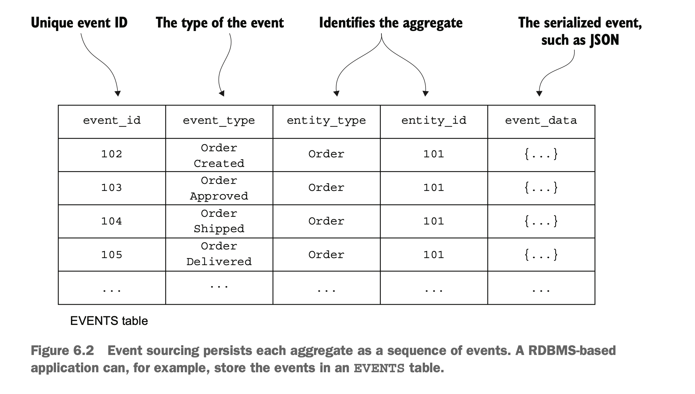
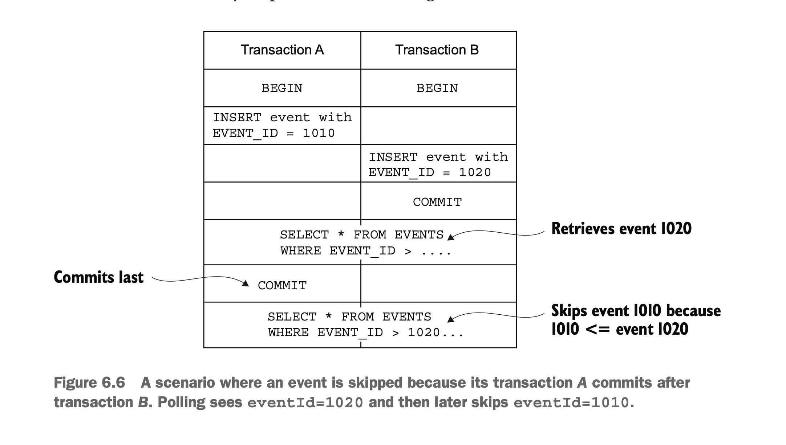
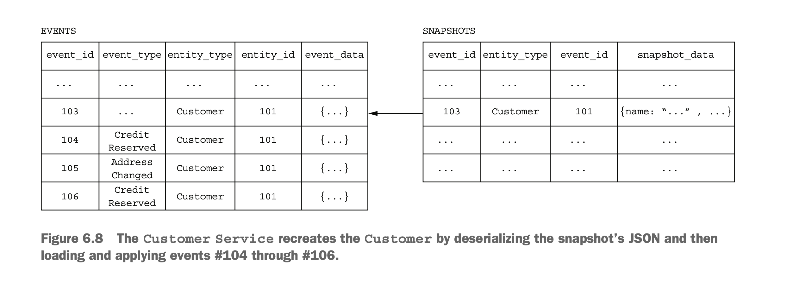
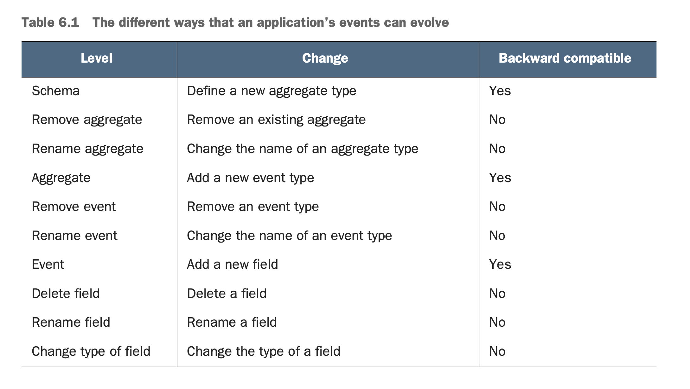
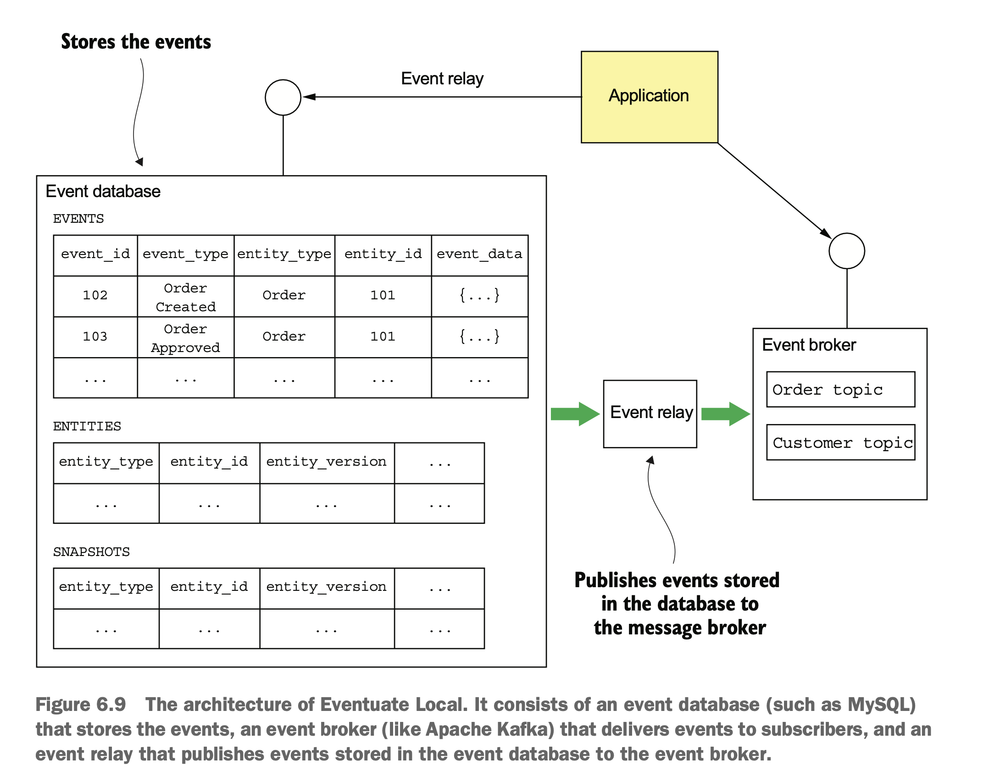

# 6. Developing business logic with event sourcing

## what is event sourcing and event store

### event sourcing

- traditional way
  - store `current state` of an aggregate in DB
- event sourcing
  - stores `changes` of an aggregate in DB
    (=a change of an aggregate -> event)
  - current state of an aggregate can be retrieved by iteratively apply the changes.

  

- loading aggregate in event sourcing

  - 1\. load the events of the aggregate
  - 2\. crate an aggregate with default constructor
  - 3\. iteratively apply the events.

- why use this? - trouble with traditional persistence
  - object-relational impedance mismatch
  - lack of aggregate history₩
  - audit logging - error prone
  - event publishing bolted onto business logic

### event and aggregate methods

- event

  - event must contain the data that the aggregate needs to perform the state transition
  - contrary to the message that has only id.

- aggregate methods

  - command method -> process + apply
  - process
    - validation + determination of state changes
    - throws exception
    - returns a list of events representing state change
  - apply: takes event parameter -> update the aggregate to the state
  - examples
    - create aggregate
      - 1\. Instantiate aggregate root using its default constructor.
      - 2\. Invoke process() to generate the new events.
      - 3\. Update the aggregate by iterating through the new events, calling its apply().
      - 4\. Save the new events in the event store.
    - update aggregate:
      - 1\. Load aggregate’s events from the event store.
      - 2\. Instantiate the aggregate root using its default constructor.
      - 3\. Iterate through the loaded events, calling apply() on the aggregate root.
      - 4\. Invoke its process() method to generate new events.
      - 5\. Update the aggregate by iterating through the new events, calling apply().
      - 6\. Save the new events in the event store.

### benefit/drawbacks of event sourcing
- benefits
  - reliably publishes domain events
  - preserves the history of aggregates
  - mostly avoid the object-relational impedance mismatch
  - provides developers with a time machine

- drawbacks
  - different programming model with a learning curve
  - complexity like messaging-based application
  - evolving events can be tricky
  - deleting data is tricky
    - traditional: soft delete(set `deleted` flag instead of removing the row)
    - laws like GDPR -> application must forget the user's personal information
    - solution: encryption
      - each user has an encryption key
      - leave the data but delete the encryption key when the user needs to be deleted
    - if the aggregate key is personal info like email address
      - replace it with uuid token, map that uuid with email in different table
  - querying the event store is challenging
    - finding objects with current state is hard

## things to think about

### optimistic locking

- to handle concurrent update
- have version column to detect whether an aggregate has changed since it was read

- update sql
  ```sql
  UPDATE AGGREGATE_ROOT_TABLE
          SET VERSION = VERSION + 1 ...
          WHERE VERSION = <original version>
  ```

### event sourcing and publishing events

- deliver events to interested consumers

  - polling and transaction log tailing
  - main difference between outbox pattern: not temporary

- polling
  - don't use event_id even though it is monotonically increasing
    ```
    SELECT * FROM EVENTS where event_id > ? ORDER BY event_id ASC.
    ```
  - transaction with lower event id may finish later than the one with higher event id
  - then the poller would miss the former event
  - instead, use extra column: `published`
    ```sql
    SELECT * FROM EVENTS where PUBLISHED = 0 ORDER BY event_id ASC.
    UPDATE EVENTS SET PUBLISHED = 1
    WHERE EVENT_ID in.
    ```
    

### snapshot

- state of aggregate in certain point
- we can apply events from this snapshot instead of default constructor
- by
  - json serialization (simple aggregate)
  - memento pattern (complex aggregate)



### idempotent message processing

- message processing: at least once -> need deduplication
- RDBMS
  - store message id in `processed_messages` table
  - process the message if its id is not in the table
- nosql
  - store message id inside the message
  - problem: some processing may not output event
  - solution: make processing always produce event(even with no state change)

### evolving domain events

- the schema of event changes. how to handle this?
- schema of event
  - consists of aggregate(s)
  - events that each aggregate emits
  - structure of the events



- how to handle the change of schema?
  - migration
  - upcaster
    - leave the events in the table as it is.
    - when reading the event, convert to the newer version format

## event store



- hybrid of database + message broker

  - API to insert, get events
  - API for subscribing to events

- ready made event stores

  - Event Store: A .NET-based open source event store developed by Greg Young, an event sourcing pioneer (https://eventstore.org).
  - Lagom: A microservices framework developed by Lightbend, the company for- merly known as Typesafe (www.lightbend.com/lagom-framework).
  - Axon: An open source Java framework for developing event-driven applications that use event sourcing and CQRS (www.axonframework.org).
  - Eventuate: Developed by my startup, Eventuate (http://eventuate.io). There are two versions of Eventuate: Eventuate SaaS, a cloud service, and Eventuate Local, an Apache Kafka/RDBMS-based open source project.

### event store's database

```sql
create table events (
  event_id varchar(1000) PRIMARY KEY,
  event_type varchar(1000),
  event_data varchar(1000) NOT NULL,
  entity_type VARCHAR(1000) NOT NULL,
  entity_id VARCHAR(1000) NOT NULL,
  triggering_event VARCHAR(1000) -- what created this event?
);
```

```sql
create table entities ( -- current state of the entity
  entity_type VARCHAR(1000),
  entity_id VARCHAR(1000),
  entity_version VARCHAR(1000) NOT NULL, -- updated every time when the entity has a change
  PRIMARY KEY(entity_type, entity_id)
);
```

```sql
create table snapshots (
  entity_type VARCHAR(1000),
  entity_id VARCHAR(1000),
  entity_version VARCHAR(1000),
  snapshot_type VARCHAR(1000) NOT NULL,
  snapshot_json VARCHAR(1000) NOT NULL,
  triggering_events VARCHAR(1000),
  PRIMARY KEY(entity_type, entity_id, entity_version)
)
```

- find
  - find snapshot.
    - if any -> construct events from there
    - if not -> construct events with all events
- create
  - inset a row into the entity table
  - insert events into the event table
- update
  - insert events into the event table
  - update entity version in entity table

### consuming events by subscribing

- to consume an aggregate's event,

  - service subscribes to the aggregate's topic
  - aggregate id: partition key

- event relay
  - propagates events in the database to broker
  - transaction log tailing / polling
  - event relay is deployed as a standalone process. \
    to restart properly, it saves the current position

## client framework with code

### Aggregate: order
```java
public class Order extends ReflectiveMutableCommandProcessingAggregate<Order,OrderCommand> {
          public List<Event> process(CreateOrderCommand command) { ... }
          public void apply(OrderCreatedEvent event) { ... }
      ...
}
```


### Aggregate command
```java
public interface OrderCommand extends Command {
}
public class CreateOrderCommand implements OrderCommand { ... }
```

### Domain Event
```java
interface OrderEvent extends Event {
}
public class OrderCreated extends OrderEvent { ... }
```

### Service calls Aggregate Repository
```java
public class OrderService {
  private AggregateRepository<Order, OrderCommand> orderRepository;

  public OrderService(AggregateRepository<Order, OrderCommand> orderRepository) {
    this.orderRepository = orderRepository;
  }

  public EntityWithIdAndVersion<Order> createOrder(OrderDetails orderDetails) {
    return orderRepository.save(new CreateOrder(orderDetails));
  }
}
```

### Subscribing to domain events

```java
@EventSubscriber(id="orderServiceEventHandlers")
public class OrderServiceEventHandlers {

  @EventHandlerMethod
  public void creditReserved(EventHandlerContext<CreditReserved> ctx) {
    CreditReserved event = ctx.getEvent();
    ...
  }

  ...
}
```


## Saga and event sourcing
-
