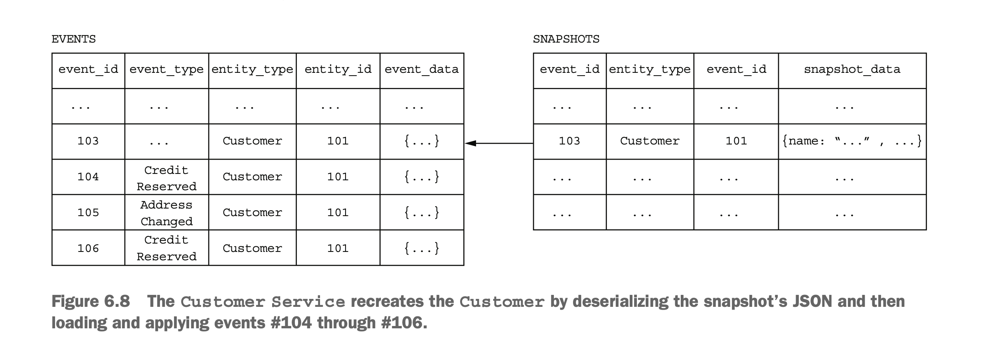
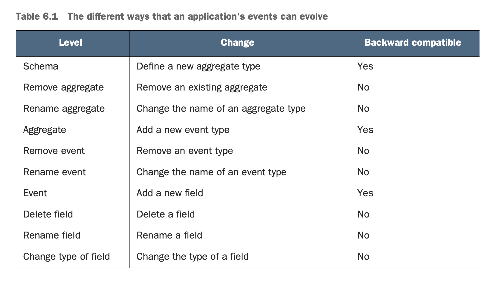
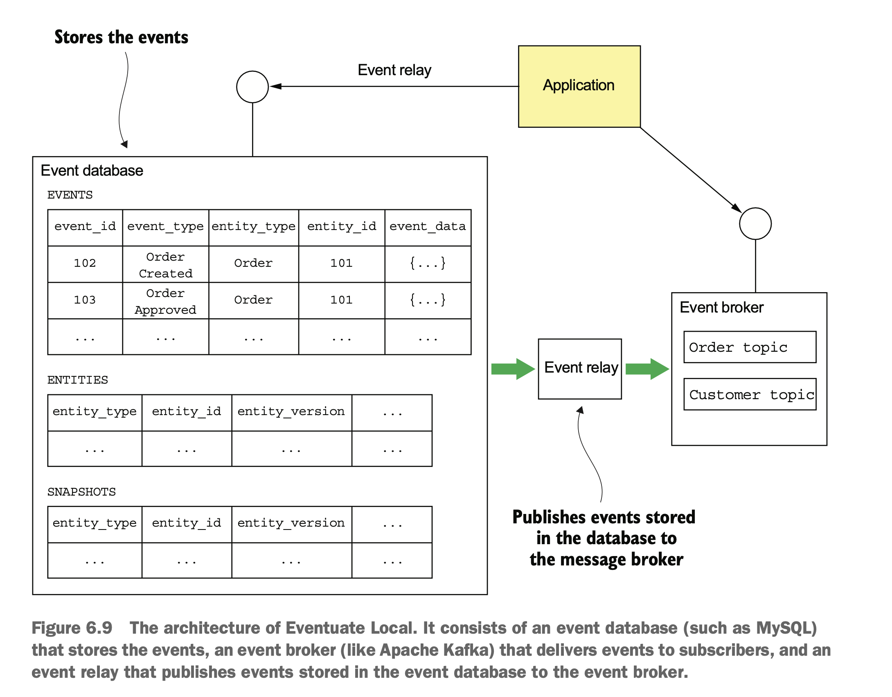

# 6. Developing business logic with event sourcing

## 6.1 overview of event sourcing

### event sourcing

- 데이터를 저장하는 전통적인 방식

  - aggregate의 `현재 상태`를 DB에 저장

- event sourcing
  - aggregate의 `변경`을 DB에 저장 \
    (aggregate의 `변경` -> event)
  - aggregate의 현재 상태는 `변경` 기록을 모두 순서대로 적용해서 구할 수 있다. \
    like) 현재 계좌 잔고는 0에서부터 모든 입출금 내역을 +/- 해서 구할 수 있다.


- aggregate 읽기(loading)
  - 1\. aggregate의 모든 event를 읽는다
  - 2\. 기본 생성자로 aggregate를 생성한다.
  - 3\. 순차적으로 event를 적용한다.

### event sourcing의 장단점

#### 장점

- 믿울 수 있는 event 발행
  - aggregate의 변경 -> event이므로
    - 개발자가 신경써서 business logic에서 발행할 필요가 없고
    - 누락이나 실수의 위험이 줄어든다
- aggregate의 변경 기록이 자동으로 남고, 감사 로그를 남기기가 쉽다
- object-relational impedance mismatch 를 피할 수 있다

  - object-relational impedance mismatch
    - object(=application), relational(=RDBMS)의 데이터 모델이 다르기 때문에 발생하는 문제
    - https://en.wikipedia.org/wiki/Object%E2%80%93relational_impedance_mismatch
    - https://hibernate.org/orm/what-is-an-orm/
  - event는 aggregate 보다 훨씬 단순하고 serializable한 구조를 갖기 때문에, 문제가 적다

- 특정 시점의 aggregate로 돌아갈 수 있다(time machine)

#### 단점

- learning curve가 가파르다
- message 기반 application과 유사한 복잡도를 갖는다
  - message 기반 architecture와 비슷한 문제를 공유한다
- event의 schema 변경 처리가 까다롭다
  - event는 DB에 영원히 저장된다
  - event의 schema가 변경시, 하위 호환성을 신경써야한다.
  - 자세한 건 뒤에
- 데이터 삭제 처리가 까다롭다
  - event sourcing에서 사용하는 전통적인 데이터 삭제 방식은 soft delete이다. \
    (soft delete = 데이터는 남겨두고, `deleted` flag/column으로 `삭제된 상태`를 표시)
  - 문제1: 유럽의 GDPR(일반정보보호규정)에는 application이 user 정보를 잊어야한다는 규정이 있다
    - 해결 방법
      - user마다 암호키를 부여해서 user의 정보를 암호화하고
      - user 정보를 삭제할 때, 암호키를 삭제해서 -> 복호화 불가능하도록 한다.
  - 문제2. email 등의 개인정보를 aggregate의 key로 사용하는 경우
    - 해결 방법
      - email마다 uuid를 부여하고, uuid를 key로 사용한다
      - uuid <-> email 의 mapping table을 유지한다.
- 현재 상태의 aggregate에 대해 query하기가 어렵다

### event 와 aggregate method

- event

  - aggregate의 변경 사항
  - event는 aggregate의 상태 변경에 필요한 모든 데이터를 담아야 한다.
  - messaging architecture에서는 message가 aggregate id만 담고 있는 형태도 있던 것과 대조된다

- aggregate method

  - command method = 변경을 일으키는 method = process + apply
  - process
    - validation + 어떤 상태로 변경할지 결정
    - validation 실패시 exception을 일으킨다
    - 상태 변경을 의미하는 event의 list를 반환한다
  - apply

    - event를 parameter로 받아서 aggregate의 상태를 변경한다

  
  

  - 큰 흐름
    - aggregate 생성하기
      - 1\. 기본 생성자로 aggregate root 생성
      - 2\. `process()`로 events 생성
      - 3\. `apply()`로 events 적용 -> 상태 변경
      - 4\. event store에 새 events 저장
    - aggregate 변경하기
      - 1\. event store에서 aggregate의 event를 가져온다
      - 2\. 기본 생성자로 aggregate root 생성
      - 3\. event store에서 읽어온 event를 `apply()` 적용한다 -> 상태 변경
      - 4\. `process()`로 events 생성
      - 5\. `apply()`로 events 적용 -> 상태 변경
      - 6\. event store에 새 events 저장

## 생각해 볼 문제

### 1\. update의 동시성 문제

- aggregate 업데이트 요청이 동시에 여러 개 발생할 수 있다
- optimistic locking이 이 문제를 해결하기 위해 흔히 쓰인다. event sourcing에도 적용 가능한 방식이다

#### optimistic locking vs pessimistic locking

- optimistic locking

  - lock을 걸지 않는다
  - version column을 통해, 다른 transaction에 으해 데이터가 변경되었는지 확인한다.
  - 데이터가 변경되지 않은 경우만 transaction을 commit하고,
    변경이 감지되면 rollback한다.(또는 + 재시도)

  ```sql
  UPDATE AGGREGATE_ROOT_TABLE
      SET VERSION = VERSION + 1 ...
      WHERE VERSION = <original version>
  ```

- pessimistic locking
  - lock을 건다

### 2\. snapshot으로 aggregate 읽기 향상하기



- snapshot: 특정 시점의 aggregate의 모습 \
  like) 특정 commit에서의 git 상태
- DB에서 aggregate를 읽어올 때, \
  기본 생성자 대신 snapshot에서부터 시작하면 성능을 향상시킬 수 있다
  - ex) 현재 마지막 event id =100이면,
    - 기본 생성자부터: event_id=0 ~ 100 apply
    - event_id=90일 때 생성한 snasphot부터: event_id=91 ~ 100 apply
    - => apply할 event가 적어진다.
- snapshot 생성 방법
  - json serialization(간단한 구조의 aggregate)
  - memento pattern(복잡한 구조의 aggregate)

#### memento pattern

- 구성 요소

  - originator: internal state를 가진 객체
  - memento: originator의 snapshot을 표현하는 객체
  - care taker: operation(=business logic)을 수행하는 객체

- 동작 방식

  - 1\. care taker가 business logic을 수행하기 전에, \
    originator에게 `cretaeMemento()`요청을 보낸다.

  - 2\. originator가 현재 상태의 snapshot(=memento)를 생성해서 caretaker에게 반환한다

  - 3\. caretaker가 rollback하고 싶다면, \
    2번에서 반환받은 memento로 `restore(memento)` 요청을 originator에게 보낸다

  - 4\. originator는 해당 memento로 상태를 복구한다.

- https://ko.wikipedia.org/wiki/%EB%A9%94%EB%A9%98%ED%86%A0_%ED%8C%A8%ED%84%B4
- https://refactoring.guru/design-patterns/memento#structure

### 3\. event sourcing으로 event 발행하기

- event sourcing에서는 aggregate의 상태 관리를 위해 event를 DB에 저장하지만, \
  이 event를 다른 consumer에게 발행할 수도 있다

- DB에 저장된 event를 consumer에게 전달하는 방법

  > 3장의 message 발행과 유사하다.

  - polling

    - event id가 항상 증가한다면, \
      마지막으로 처리한 event보다 `event id`가 큰 event만 polling해서 가져오는 방식을 생각해볼 수 있다
    - 하지만 사진처럼 큰 event_id를 다루는 transaction이 먼저 종료되는 경우, \
      누락되는 event가 발생할 수 있어, 별도 필드(published)를 이용하는 것이 좋다

    ```sql
    SELECT * FROM EVENTS where PUBLISHED = 0 ORDER BY event_id ASC.
    UPDATE EVENTS SET PUBLISHED = 1
    WHERE EVENT_ID in.
    ```

    

  - transaction log tailing
    - events table에 추가된 event를 발행한다
    - 이 방식이 낫다
    - 뒤에서 eventuate framework와 함께 설명한다.

### 4\. 멱등적 message 처리

- message는 at least once 방식으로 전달되는 경우가 많다 \
  따라서, deduplication이 필요하다 \
  event sourcing 도 동일한 문제를 고려해야한다
- RDBMS
  - 처리한 message의 message_id를 `processed_messages` table에 저장한다.
  - message 처리 전에 이 table에 없는지 확인한다
- nosql
  - transaction이 없기 때문에, RDBMS와 동일하게 처리할 수 없다
  - event 객체 안에 처리한 message_id를 저장한다
  - 문제: event를 발생시키지 않는 message가 있을 수 있다
  - 해결방안: 가짜(?) event를 만들어서 message가 항상 event를 발생시키게 한다 \
    (상태 변경이 없더라도 event 생성)

### 5\. event schema 변경

- event의 schema가 변경될 수 있다
- event sourcing application에서 다루는 3가지 schema

  - aggregates
  - aggregate가 생성한 event
  - event의 구조

- event는 장기간 DB에 보관되므로, schema 변경시 하위 호환성을 고려해야한다
  - 하위 호환되지 않는 변경사항 처리하기
    - migration
      기존에 생성된 event도 신규 버전에 맞춰 변경하기
    - upcasting(upcaster)
      - DB의 데이터는 그대로 둔다
      - 데이터를 읽어올 때, 최신 schema로 읽는다
      - application logic을 최신 schema로만 구현하면 된다.



## 6.2 event store



- hybrid of database + message broker

  - event 생성, 조회 API
  - event 구독 API

- 이미 존재하는 event store
  - Event Store: A .NET 기반 open source event store. developed by Greg Young, an event sourcing pioneer (https://eventstore.org).
  - Lagom: A microservices framework developed by Lightbend, the company for- merly known as Typesafe (www.lightbend.com/lagom-framework).
  - Axon: An open source Java framework for developing event-driven applications that use event sourcing and CQRS (www.axonframework.org).
  - Eventuate: Developed by my startup, Eventuate (http://eventuate.io). There are two versions of Eventuate: Eventuate SaaS, a cloud service, and Eventuate Local, an Apache Kafka/RDBMS 기반 open source project.

### event store의 DB 구조

```sql
create table events (
  event_id varchar(1000) PRIMARY KEY,
  event_type varchar(1000),
  event_data varchar(1000) NOT NULL,
  entity_type VARCHAR(1000) NOT NULL,
  entity_id VARCHAR(1000) NOT NULL,
  triggering_event VARCHAR(1000) -- 이 event를 생성한 event
);
```

```sql
create table entities ( -- entity의 현재 상태
  entity_type VARCHAR(1000),
  entity_id VARCHAR(1000),
  entity_version VARCHAR(1000) NOT NULL, -- entity가 변경될 때마다, 같이 업데이트한다.
  PRIMARY KEY(entity_type, entity_id)
);
```

```sql
create table snapshots (
  entity_type VARCHAR(1000),
  entity_id VARCHAR(1000),
  entity_version VARCHAR(1000),
  snapshot_type VARCHAR(1000) NOT NULL,
  snapshot_json VARCHAR(1000) NOT NULL,
  triggering_events VARCHAR(1000),
  PRIMARY KEY(entity_type, entity_id, entity_version)
)
```

- aggregate 조회하기

  - snapshot이 있는지 확인한다
  - snapshot이 있으면, snapshot 생성 이후의 event만 조회 + apply
  - snapshot이 없으면, 모든 event 조회 + 기본 생성자로부터 apply

- aggregate 생성하기

  - entity table에 row 삽입
  - event table에 event 삽입

- aggregate 업데이트하기
  - event table에 event 삽입
  - entity table에서 entity_version 변경

### event 구독하기

- 구독하기

  - aggregate의 topic을 구독한다
  - aggregate id가 partition key로 쓰인다

- event relay
  - DB의 event를 broker로 전파하는 역할
  - transaction log tailing / polling 방식을 쓴다
  - event relay는 독립적인 process로 실행한다 \
    재시작시을 대비해서, 어디까지 처리했는지를 저장한다

## client framework with code


### Aggregate: order

```java
public class Order extends ReflectiveMutableCommandProcessingAggregate<Order,OrderCommand> {
          public List<Event> process(CreateOrderCommand command) { ... }
          public void apply(OrderCreatedEvent event) { ... }
      ...
}
```

### Aggregate command

```java
public interface OrderCommand extends Command {
}
public class CreateOrderCommand implements OrderCommand { ... }
```

### Domain Event

```java
interface OrderEvent extends Event {
}
public class OrderCreated extends OrderEvent { ... }
```

### Service는 Aggregate Repository를 호출한다.

- Repository
  - `find()`
  - `save(Command)`
  - `update(Command, Aggregate)`


```java
public class OrderService {
  private AggregateRepository<Order, OrderCommand> orderRepository;

  public OrderService(AggregateRepository<Order, OrderCommand> orderRepository) {
    this.orderRepository = orderRepository;
  }

  public EntityWithIdAndVersion<Order> createOrder(OrderDetails orderDetails) {
    return orderRepository.save(new CreateOrder(orderDetails));
  }
}
```

### domain events 구독

```java
@EventSubscriber(id="orderServiceEventHandlers") // id of subscription
public class OrderServiceEventHandlers {

  @EventHandlerMethod // define event handler
  // EventHandlerContext: event and metadata
  public void creditReserved(EventHandlerContext<CreditReserved> ctx) {
    CreditReserved event = ctx.getEvent();
    ...
  }

  ...
}
```

## 6.3 Saga and event sourcing
- MSA에서 saga가 일반적으로 쓰인다.
  여기서는 saga와 event sourcing을 같이 사용하는 경우를 생각해본다.
- orchestration 기반 saga보다 choreography 기반 saga에서 event sourcing을 이용하기가 더 쉽다
  - 아래 작업이 원자성을 가져야하기 때문
    - saga 생성: aggregate 생성/변경, saga orchestrator 생성
    - saga orchestration: reply, 상태 변경, command 발행
    - saga 참여자: message 중복 제거, aggregate 생성/변경, reply

- messaging system처럼 중복 제거가 필수이다.
  - 중복 제거의 key로 aggregate id, event id를 사용할 수 있다.

### event sourcing으로 choreography 기반 saga 구현하기
- 쉽다.
  - aggregate가 update 되면 -> event가 생성된다
  - event handler는 domain event를 consume하고 본인의 aggregate update한다
- 문제점
  - 1\. event가 발생해야, consumer(event handler)가 business logic을 처리하기 때문에
    aggregate에 변경이 없더라도 event를 반환해야한다
    ex) validation 실패 -> 에러 발생을 알리기 위해 event 반환
  - 2\. saga 참여자가 aggregate를 생성하지 않는 경우가 있을 수도 있다.
  - => 따라서, 복잡한 saga는 orchestration 기반가 더 적합하다.
    

### event sourcing 으로 orchestration 기반 saga 구현하기
- 두 operation을 원자적으로 처리해야한다.
  - aggregate 생성/변경
  - saga orchestrator 생성

- RDBMS 기반 event store
  - transaction으로 묶는다.

  ```java
  // class OrderService
      @Autowired
      private SagaManager<CreateOrderSagaState> createOrderSagaManager;

      // 1개의 transaction에서
      @Transactional
      public EntityWithIdAndVersion<Order> createOrder(OrderDetails orderDetails) {

          // aggregate 생성
          EntityWithIdAndVersion<Order> order = orderRepository.save(new CreateOrder(orderDetails));

          // saga 생성
          CreateOrderSagaState data = new CreateOrderSagaState(order.getId(), orderDetails);
          createOrderSagaManager.create(data, Order.class, order.getId());
          
          return order; 
      }
  ```

- nosql 기반 event store
  - transaction이 없다.
  - 대신에, event handler가 saga를 생성하게 한다.(순차적)
    - 1\. command 발생
    - 2\. aggregate 상태 변경 -> event 저장(발생)
    - 3\. event handler 가 감지  -> saga 생성
  
  - RDBMS에서도 이렇게 처리해도 된다.
    - 느슨한 coupling이 된다.
  
  

### event sourcing 기반 saga 참여자
- 멱등적으로 command message를 처리해야한다. 
  - 이미 처리된 message인지 먼저 검증한다
- 원자적으로 reply message를 보내야한다.
  - 간단하게 생각하면,
    - saga 참여자가 reply message를 보내지 않고,
      orchestrator가 aggregate의 event를 구독한다
    - 문제1: saga command가 aggregate의 상태를 변경하지 않을 수 있다. -> reply 감지 불가
    - 문제2
      - event sourcing 방식의 saga 참여자와, 다른 참여자를 구별해서 처리해야한다
        - event sourcing 방식의 saga 참여자의 reply: event 구독
        - 다른 참여자: reply channel을 구독

  - 더 나은 방식
    - saga 참여자가 reply channel로 응답한다.
    - saga command handler가 aggregates를 생성/변경할 때,
      `SagaReplyRequested`라는 가짜 event를 같이 생성한다.
      ex) `authorize event` command가 발생했을 때,
        - 1\. command handler는 event를 2개 반환한다.: `accountAuthorized`, `sagaReplyRequested`
        - 2-1. `accountAuthorized` event를 저장한다. 
        - 2-2. `sagaReplyRequested` event handler가 reply channel로 메세지를 보낸다.


```java
public class AccountingServiceCommandHandler {
  
  @Autowired
  private AggregateRepository<Account, AccountCommand> accountRepository;

  public void authorize(CommandMessage<AuthorizeCommand> cm) {
    AuthorizeCommand command = cm.getCommand();

    // event 저장
    accountRepository.update(command.getOrderId(), // message id 로 멱등적 처리
      command,
      replyingTo(cm) // 가짜 pseudo event SagaReplyRequested를 사용해서 reply
        .catching(AccountDisabledException.class,
              () -> withFailure(new AccountDisabledReply())) // error 대신 다른 응답
        .build());
  }
}
```

